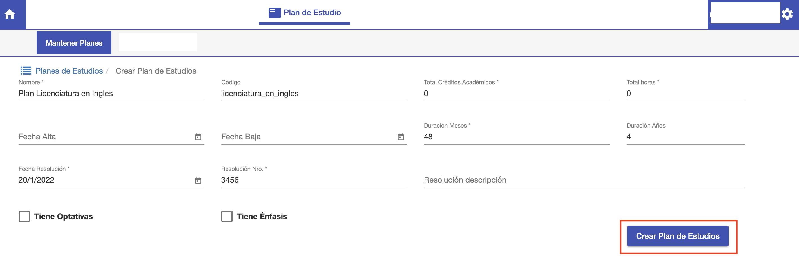

#Crear Plan de Estudios

Para crear un plan de estudio hacer clic en el botón *+ Crear* que se encuentra en la interfaz
de listado de planes.

Se despliega la interfaz para crear un plan de estudios, con los suguientes campos:

- *Nombre*: El nombre que va a llevar el plan de estudios.
- *Codigo*: Código para diferenciar al plan de estudios.
- *Total Créditos Académicos*: Cantidad de créditos que se requieren para completar. 
- *Total horas*: Total de horas cátedra.
- *Fecha Alta*: Fecha en que se habilita para utilizar el plan de estudios.
- *Fecha Baja*: Fecha en que se dió de baja el plan de estudios.
- *Duración Meses: Cantidad de meses que dura la carrera según este plan de estudios.
- *Duración Años: Cantidad de años que dura la carrera según este plan de estudios.
- *Fecha Resolución*: Fecha de la resolución que dá de alta el plan.
- *Resolución Nro*: Nro de resolución que da de alta el plan.
- *Resolución descripcion*: Descripción de la resolucion.
- *Tiene Optativas*: Se marca para indicar que el plan tiene asignaturas que son optativas, es decir
que no requieren aprobar o cursar para terminar el plan de estudios.
- *Tiene Énfasis*: Se marcar para indicar que el plan tiene espcializaciones.

Se completan los datos necesarios y luego hacer clic en *Crear Plan de Estudios*.

Se crea el plan y el sistema despliega la pantalla para editar el plan y continuar registrando
más datos.

