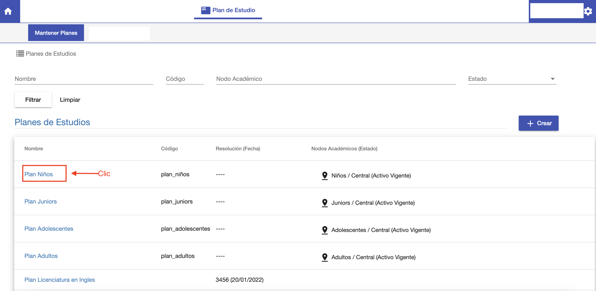
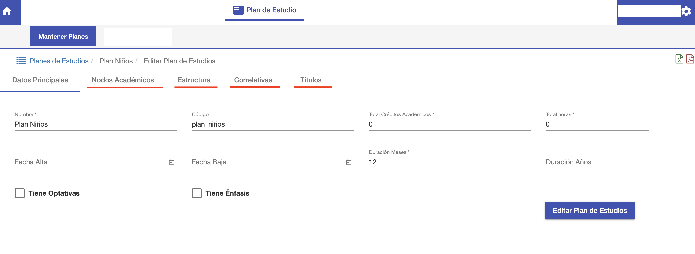

#Editar
Para editar un plan de estudios ir al listado de planes, buscar el plan de estudios a 
editar y hacer clic sobre el nombre del plan de estudios.

El sistema despliega la interfaz para editar el plan de estudios. Esta interfaz ofrece las siguientes pestañas:

- *Datos Principales*: Para editar los datos con los que se creó el plan
de estudios.
- *Nodos Académicos*: Para asignar el plan a las carreras definidas en la estructura
académica. 
- *Estructura*: Para definir la malla curricular, compuesta de asignaturas y etiquetas.
- *Correlativas*: Permite definir las correlatividades de la malla curricular.
- *Títulos*: Permite definir el título que se otorga al cursar el plan.

