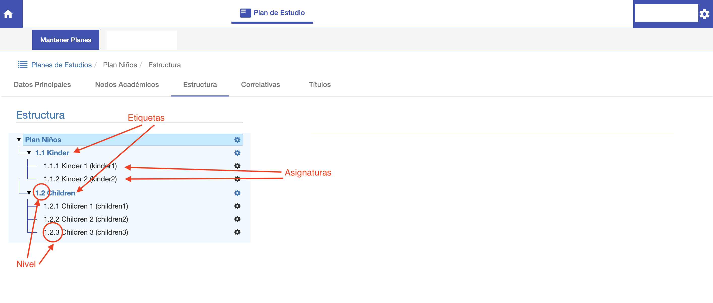
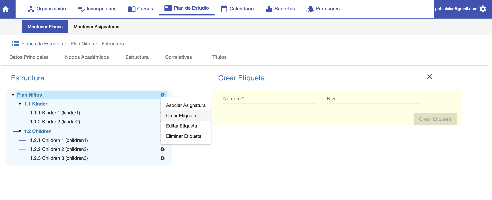
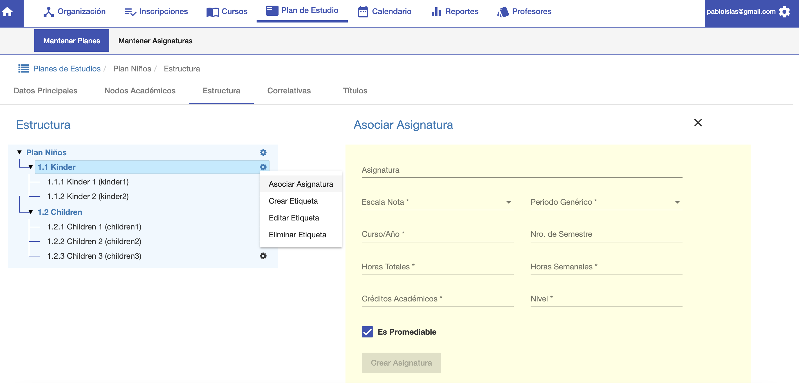

#Estructura

La estructura del plan consiste en la definición de:

 - Las asignaturas que componen el plan.
 - Las etiquetas o agrupaciones de las asignaturas.

##Etiquetas
Las etiquetas permiten agrupar las asignaturas.
Una etiqueta puede tener subetiquetas. De tal manera a realizar una estructura jerárquica.
Una etiqueta tiene dos campos:

- *Nombre*: Nombre de la etiqueta para diferenciar en el plan.
- *Nivel*: Para indicar el nivel dentro del plan. Las asignaturas de la etiqueta se pueden
considerar en un subnivel de la etiqueta.

Para agregar una etiqueta, clic en el botón ⚙️ y se despliega una ventana donde
podemos elegir la acción Crear Etiqueta. 

Se despiega una sección a la derecha de la pantalla
donde se completan los datos de la etiqueta. Luego hacer clic en Crear Etiqueta.

Obs. Para crear una subetiqueta clic en el botón ⚙ de la etiqueta dentro de la cual se
quiere crear la subetiqueta. Por ej, si se quiere crear una subetiqueta en Kinder, clic en
⚙️ de la etiqueta Kinder.

##Asignaturas
La estructura puede conformarse con las asignaturas que ya fueron definidas en la funcionalidad
de Plan de Estudio/Asignaturas.
Para agregar una asignatura clic en el botón ⚙️ de la etiqueta donde
se desea agregar la asignatura y elegir la acción Asociar Asignatura. Se despliega una
sección a la derecha de la pantalla con los campos para elegir y asociar la asignatura al plan.

Los datos para agregar una asignatura son:

- *Asignatura*: Se elije una asignatura para agregar al plan.
- *Escala Nota*: Se elije la escala de notas que corresponde a la asignatura. Ej 1 al 5.
- *Periodo Genérico*: Se asigna el periodo al que corresponde. Es para organizar la malla. Por ej 1er Semestre.
- *Curso/Año*: Opcional. Se asigna el año de la carrera donde se da la asignatura.
- *Nro. de Semestre*: Opcional. Se asigna el semestre de la carrera donde se da la asignatura.
- *Horas Totales*: La cantidad de horas cátedra de la asignatura.
- *Horas Semanales*: La cantidad de horas semanales de la asignatura en sus cursos.
- *Creditos Académicos*: La cantida de créditos académicos que otorga la asignatura.
- *Nivel*: El nivel que corresponde a la asignatura.

##Niveles
Se sugiere utilizar una codifición para distinguir los niveles.

Por ejemplo el plan Niños tiene un nivel 1.
Luego la etiqueta Niños/Kinder tiene un subnivel 1.1 y la etiqueta Niños/Children tiene un subnivel
1.2.

Y así sucesivamente las asignaturas de cada etiqueta tienen un subnivel de 1.1.1, 1.1.2 etc. 

De esta podemos ordenar el nivel de un plan. Y también podemos distinguir los niveles entre planes.
Para un plan de nivel superior, podemos utilizar el código 2.

Por ejemplo el plan de la carrera Juniors va a tener un código 2, sus etiquetas tendrán un código
2.2, 2.3 etc. Y sus asignaturas 2.1.1,..., 2.2.1... y así sucesivamente.

Entonces esta codificación se puede utilizar para distinguir entre niveles de un plan y entre
niveles de varios planes.