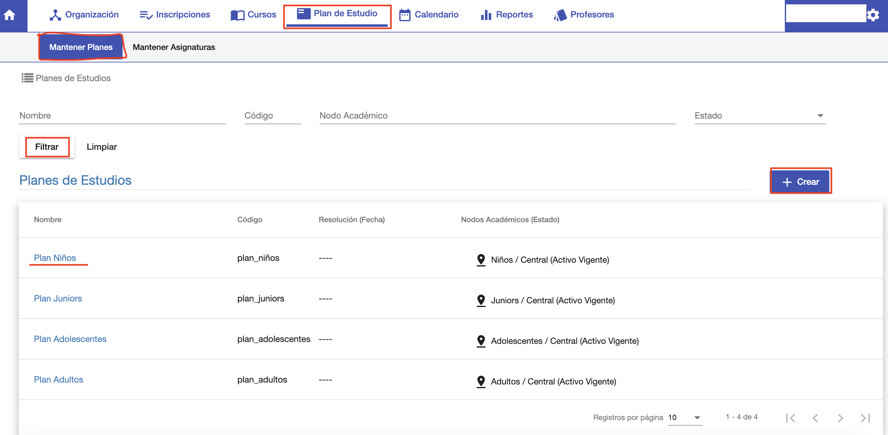

#Mantener Planes

@@toc
@@@ index
* [Crear](crear.md)
* [Editar](editar.md)
* [Nodos Académicos](nodos_academicos.md)
* [Estructura](estructura.md)
@@@

Un plan de estudios se asocia a una carrera para definir la malla curricular.
El plan de estudio se debe estructurar con las asignaturas que deben o pueden cursar
los alumnos de la carrera.

Para gestionar planes de estudio, ingresar al módulo *Plan de Estudio* y luego ir a la opción
*Mantener Planes*.

Se despliega una interfaz que permite:

- Buscar y listar planes.
- Crear plan de estudios.
- Editar plan de estudios.

##Listado

La interfaz de listado ofrece una grilla donde se muestran los planes
ya registrados.
Para buscar, ofrece los siguientes filtros de búsqueda:

 - Nombre. Permite buscar planes por nombre,
 - Código. Permite buscar planes por código.
 - Nodo Académico. Permite elegir una carrera y buscar planes de una carrera.
 - Estado. Permite buscar planes por estado.

Luego de completar los filtros, clic en el botón *Filtrar* y se muestran los resultados 
en la grilla.

 

