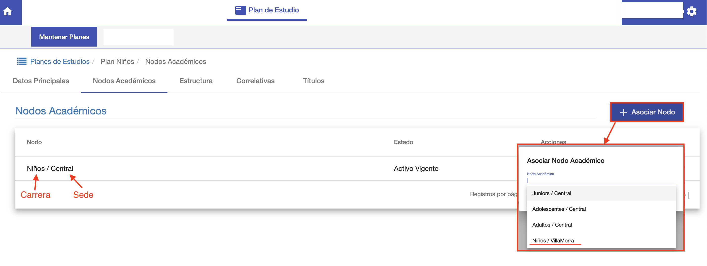
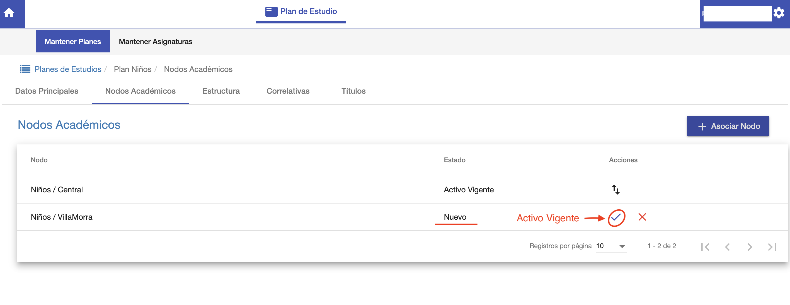

#Nodos Académicos

La pestaña *Nodos Académicos* permite asociar el plan a las carreras que corresponda.
Un nodo académico en este contexto, consiste en una Carrera/Sucursal. Es decir una carrera
que se dicta en una Sucursal o Sede.

Al asignar un plan de estudios a una Carrera/Sede o Nodo Académico. Este va a permitir
abrir cursos con las asignaturas del plan para la Carrera/Sede.

Para asociar el plan con un nodo académico, clic en *+Asociar Nodo*. Y se despliega
un listado de Carrera/Sede a los cuales asociar.
En este ejemplo se elije Niños/Villamorra. Esto significa que el plan se asocia
a la Carrera Niños que se da en la sede de Villamorra.
Luego de asignar, el nodo aparece en la grilla:

##Activación del plan

El nodo recién asociado queda en estado Nuevo, hacer clic en la acción ☑️ para
pasar al estado *Activo Vigente* y activar el plan para la carrera. Un plan
debe estar en estado *Activo Vigente* para poder ser utilizado.
Es decir, para poder crear cursos e inscribir alumnos.