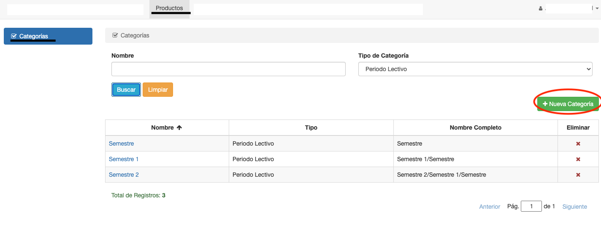
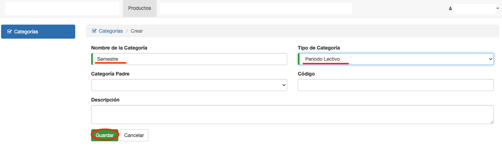
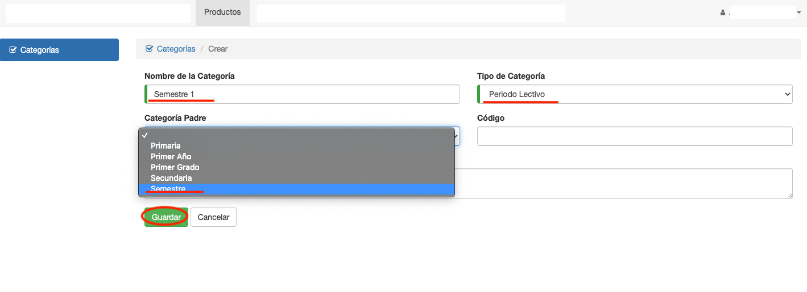

# Crear Categoría

Para crear una categoría, se aprieta el botón Crear Categoría que aparece en el listado de categorías.

## Crear Categoria Padre
Para crear una categoría padre, se completan los campos:

* Nombre
* Tipo de categoría

El campo Categoría Padre se deja en blanco, para que sea una categoría superior.
El campo código es opcional, y está disponible por si se requiera utilizar este campo
en algún momento.

## Crear Subcategoría
Para crear una categoría hija, se completan los campos:

* Nombre
* Tipo de Categoría
* Categoría Padre

El campo código es opcional, y está disponible por si se requiera utilizar este campo
en algún momento.

**Observaciones**

* El sistema valida que no se puedan crear categorías con nombre o código repetidos.
* Los tipos de categorías, en esta versión, se crean por base de datos. Contactar con Enteprise
Solutions para configurar los tipos de categorias requeridos.