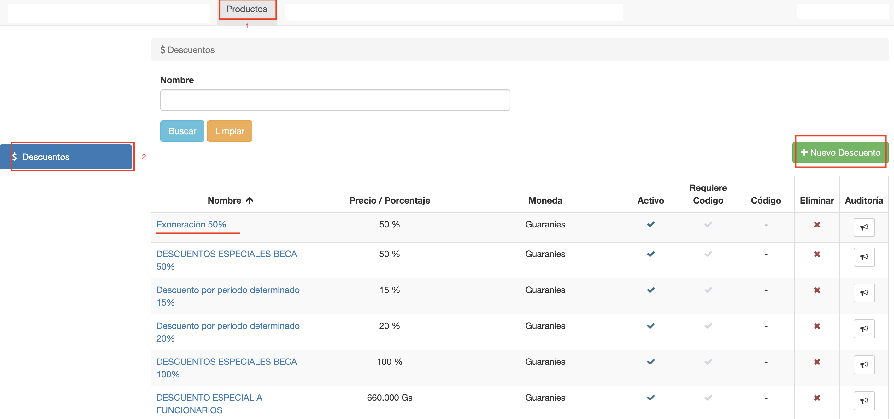
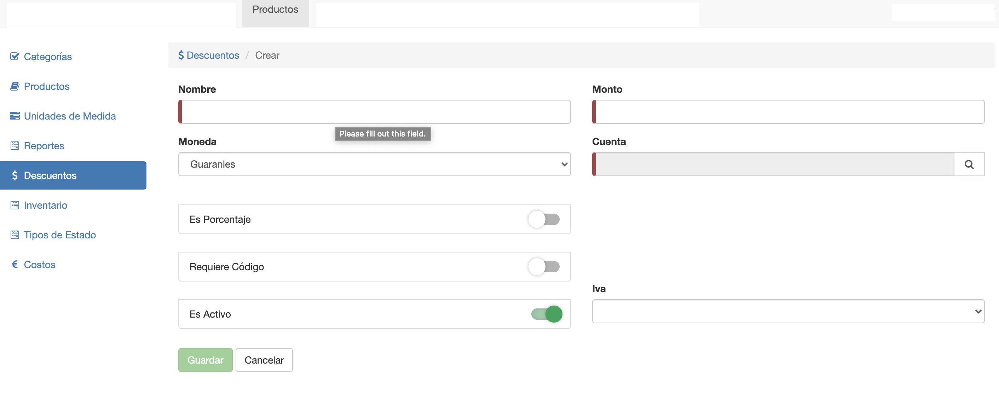
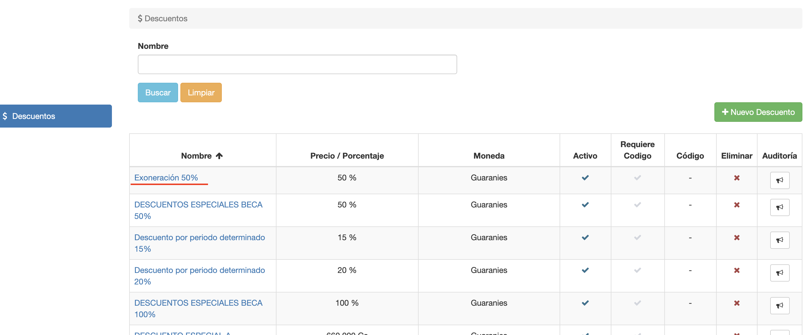
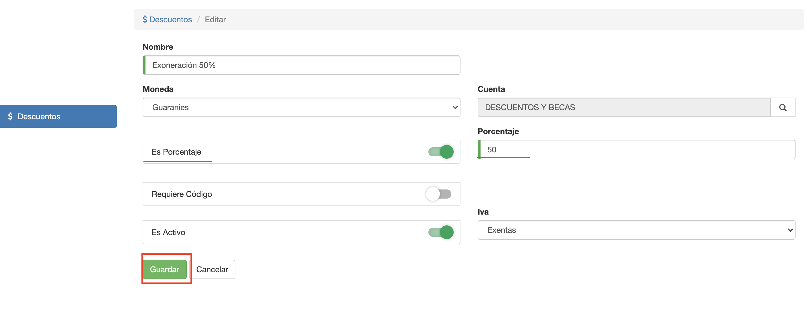

#Descuentos

Los descuentos se pueden utilizar en el sistema para:

- Definir aranceles o esquemas de cuotas con descuentos.
- Aplicar descuentos directamente en factura de venta.

Para acceder a la funcionalidad de mantener descuentos: 
clic en el módulo **Productos** y luego seleccionamos la opción **Descuentos**, en el menú izquierdo:

Desde esta interfaz se puede:

- Listar y buscar por nombre los descuentos ya creados.
- Crear descuento
- Borrar descuento
- Editar Descuento

*Obs.* El descuento Bonificación es un descuento especial, que se utiliza como
descuento por pago anticipado. Se puede utilizar en los esquemas y se aplica sólo
si el pago se realiza de manera anticipada.

##Crear Descuento
Para crear un descuento clic en el botón *Nuevo Descuento* y se despliega la
interfaz para crear el descuento.

Se completan los campos:

- **Nombre**: Nombre único para identificar al descuento.
- **Monto**: Monto del descuento, se utiliza este campo en caso de que no esté marcada la casilla **Es Porcentaje**.
- **Moneda**: Se define la moneda del descuento. Esto define que se puede aplicar sobre los precios y facturas de la moneda elegida.
- **Es Porcentaje**: Se desmarca esta casilla, si el descuento es por monto. Si se marca esta casilla, se habilita un campo para definir el porcentaje del descuento.
- **Requiere Código**: Se marca esta casilla, para definir un código de seguridad necesario para habilitar el descuento en las facturas. Sólo se puede aplicar el descuento, si se sabe el código.
- **Es Activo**: Para habilitar o deshabilitar el uso del descuento. Si se deshabilita, no afecta a los precios o facturas que ya lo utilizaron. No se podrá utilizar o asignar posteriormente a la deshabilitación.
- **Iva**: Se define el tipo de iva con que se imputa el descuento en factura. IVA incluido.

##Borrar Descuento
Para borrar un descuento, clic en la columna Eliminar del descuento que se desea borrar. El sistema
va a pedir confirmación y si el usuario confirma, va a intentar borrar el descuento.
No se va a poder borrar el descuento, si ya fué utilizado en alguna venta o factura.

##Editar descuento

Para editar un descuento, clic en la columna Nombre del descuento que se desea editar. El sistema despliega
la interfaz con los datos del descuento.

En este ejemplo, se muestra un descuento de tipo porcentaje. Pueden editarse los datos del
descuento y luego clic en *Guardar*.

*Obs.* Si se edita un descuento, afecta a los descuentos que se van a aplicar en adelante y tb a los ya aplicados, que se calculan diariamente como por ej. Por Pago Anticipado. 
No afecta a los descuentos ya aplicados 
a facturas o ventas.

