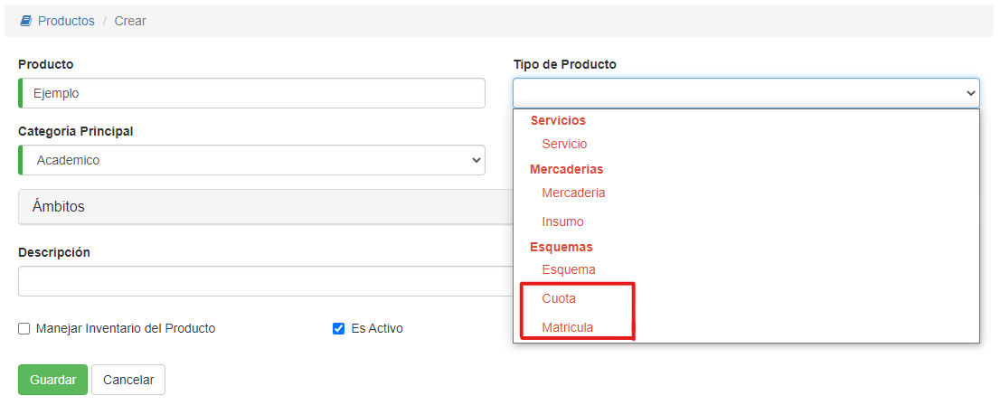

#Precio Concepto de Esquema

Si escogimos un tipo de producto **Cuota** o **Matrícula**, es porque queremos agregarlo a un **Esquema**.
Entonces el precio se configura en el esquema. Y no es necesario agregar aquí un precio. Se puede
pulsar entonces **Cancelar**

Si es necesario, puede registrarse un precio unitario para el concepto. De tal manera a poder facturar o vender de manera
individual este producto.
Para ello, completar los datos del precio y pulsar **Guardar**
