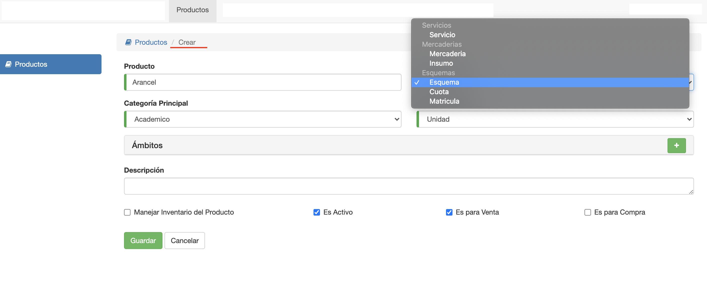

#Esquema
@@toc { depth=1 }
@@@ index
* [Conceptos](esquemas/conceptos.md)
* [Ajustes](esquemas/ajustes.md)
@@@

Luego de crear un producto de tipo **Esquema**, el sistema nos mostrará una interfaz para crear el precio o *Esquema*:

Los campos para crear el esquema son:

- **Nombre**: El nombre del esquema.
- **Moneda**: La moneda del esquema.
- **Descripcion**: Campo opcional. Para registrar una observación en el precio.

Luego click en **Guardar**, para crear el esquema. 
Se crea un esquema vacío. Al cual se tienen que ir agregando componentes.
Los componentes de un esquema pueden ser:

1. Conceptos. Son los conceptos como Matrícula o Cuota, deudas que se deben generar al 
al vender un esquema.
2. Ajustes. Son las multas y/o descuentos, que se definen sobre los conceptos
del esquema.

Luego de crear el esquema de un producto, el esquema puede accederse en la pestaña *Precios* del producto, para editarse.

