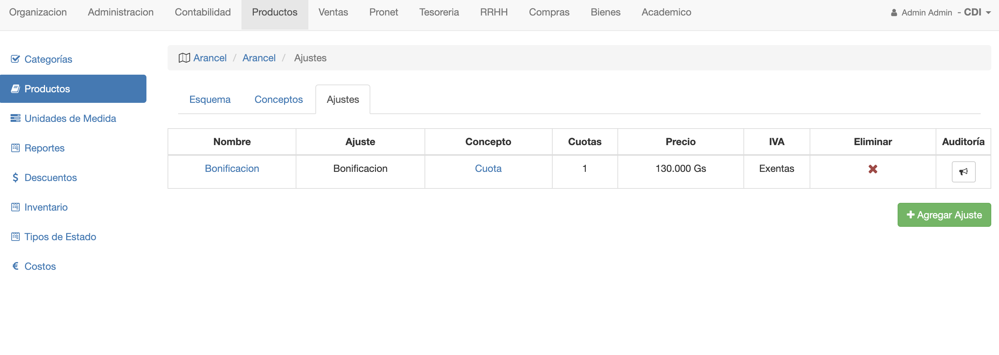
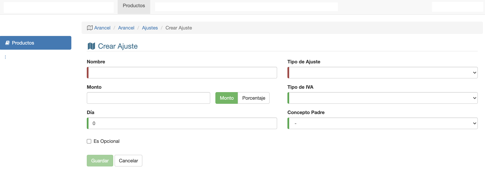
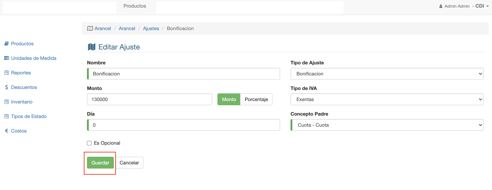

#Ajustes De Esquema

Los ajustes pueden agregarse a conceptos del esquema.
Un ajuste puede ser:

 - Descuento. Aplica descuento a un concepto.
 - Recargo. Aplica un recargo a un concepto, si el concepto venció y no fue pagado.

##Descuentos
Los descuentos se deben crearse primero, en el módulo Productos/Descuentos.
Para poder asignarlos como ajustes.
Los ajustes de tipo Descuento:

- Pueden ser por monto o porcentaje.
- Pueden aplicarse de manera automática o manualmente.
- Pueden ser por pago anticipado. Este descuento ya debe estar
configurado en el sistema previamente. Tiene el nombre de Bonificacion.

##Recargos
Los recargos debe crearse primero, antes de poder utilizarse como ajustes. Para crear
recargos ir a módulo Productos y crear un producto de tipo Recargo.
Los ajustes de tipo recargos:

- Pueden ser por monto o porcentaje.
- Puede definirse apartir de cuantos días de vencido, se aplica el recargo.

Para acceder a los ajustes de un esquema:
1. Se accede al producto.
2. Luego se abre la pestaña Precios del producto.
3. Se abre el esquema.
4. Se abre la pestaña Ajustes del esquema.

##Listado de Ajustes de Esquema
Al abrir la pestaña *Ajustes* se muestra un listado de los 
ajustes asignados al esquema.
Cada ajuste se muestra con el concepto al que fué asignado.

Desde esta pestaña se puede además:

- Borrar Ajuste
- Agregar Ajuste

##Borrar Ajuste
Se puede borrar ajuste de un esquema, si es que aún no fue aplicado el ajuste en alguna
venta o inscripcion.
Para borrar el ajuste, clic en la columna *Eliminar* del ajuste.

##Agregar Ajuste
Para agregar un ajuste, clic en botón Agregar Ajuste y se muestra la
interfaz para agregar ajuste.

Los campos para crear un ajuste son:

- **Nombre**:           Nombre con el que se va a generar el ajuste en la deuda.
- **Tipo de Ajuste**:   Se el elije el descuento o recargo correspondiente al ajuste.
- **Monto/Porcentaje**: Se completa el monto o porcentaje del ajuste y se marca si es por monto o porcentaje.
- **Tipo de Iva**:      Se elije el tipo de iva con que se imputa el ajuste al facturar. El monto del ajuste, es iva incluido.
- **Día**:              Si el ajuste es recargo, define luego de cuantos días del vencimiento, se aplica el recargo a la deuda vencida.
- **Concepto Padre**:   Se elije a qué concepto del esquema, se aplica el ajuste.

##Editar Ajuste
Para editar un ajuste, ir al listado de ajustes y hacer clic en la columna
Nombre del ajuste que se quiere editar.
Entonces se muestra la pantalla con los datos del ajuste. Se pueden modificar
los campos necesarios y guardar.

*Obs* Si se edita un ajuste:
No se va a aplicar a descuentos manuales ya aplicados.
Si se va a aplicar a descuentos por pago anticipados que aún no vencieron. Ya que el sistema
calcula la habilitación de estos descuentos cada día.

