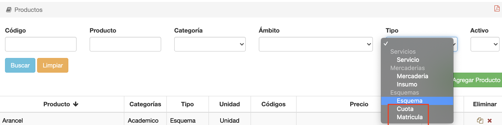
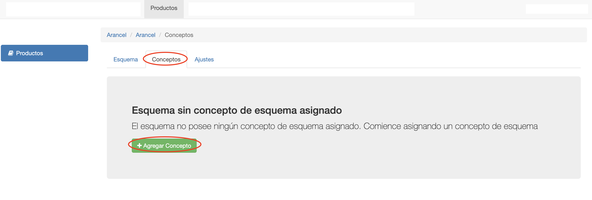
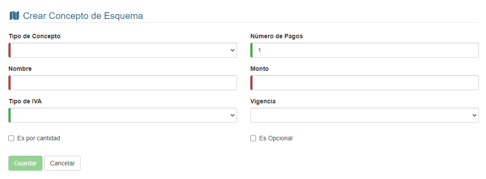
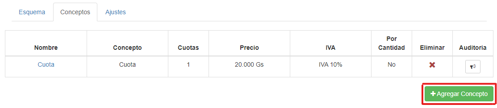
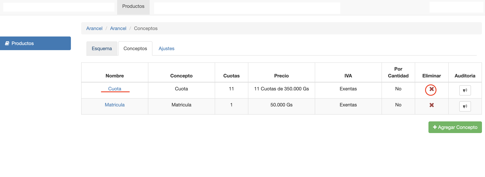
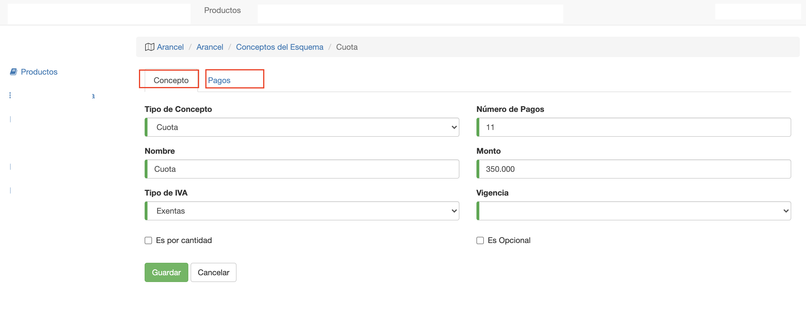

# Conceptos De Esquema

@@toc { depth=1 } 
@@@ index
* [Pagos](pagos_de_concepto.md)
@@@

## Conceptos

El esquema se conforma con otros productos. Por ej. Puede tener Cuota y Matrícula. Los productos que pueden agregarse a
un esquema son los de tipo:

- Cuota
- Matricula

Estos productos, ya deben estar previamente registrados en el sistema.

## Agregar Concepto a Esquema

Para agregar un concepto al esquema, ingresamos al esquema y vamos a la pestaña Conceptos y clic en **Agregar
Concepto**:

Se despliega una ventana modal donde completar los datos del concepto para agregar al esquema.

Los campos son:

- **Tipo de Concepto**: Se elije el producto de tipo cuota o matrícula a utilizar para el concepto.
- **Número de Pagos**:  Se define la cantidad de cuotas o pagos del concepto. Al generar la deuda, se van a generar la
  cantidad de cuotas definidas en este campo.
- **Nombre**: Se define el nombre o detalle que va a figurar para el concepto. En la deuda generada y facturas de venta.
- **Monto**: Se define el monto,IVA incluido, de cada cuota del concepto.
- **Tipo de Iva**: Se define el iva que se va a aplicar al facturar el monto del concepto.
- **Vigencia**: Se puede definir, opcionalmente, si el concepto tiene una validez o vigencia de tiempo. Por ej si la
  matrícula puede tener una vigencia de 2 años.
- **Es por Cantidad**: Este campo es opcional, y define si la cuota se calcula de acuerdo a la cantidad de horas del
  curso. Si se marca este campo, el monto pasa a ser el precio_unitario que se multiplica por la cantidad de horas del
  curso.
- **Es Opcional**: Este campo define si un concepto es opcional, entonces no se aplica automáticamente al generar la
  deuda. Se debe aplicar manualmente a la inscripción posteriormente, por un usuario del sistema.

Después de ingresar los datos, hacemos clic en **Guardar**.

Si se quiere agregar otros conceptos al esquema, clic en **Agregar Concepto** y se sigue el mismo procedimiento:

## Listado de Conceptos

En la pestaña conceptos se muestra el listado de los conceptos agregados al esquema. Desde esta lista se puede:

- Borrar un concepto del esquema
- Acceder a un concepto para editarlo

## Borrar Concepto

Para borrar un concepto, clic en el botón de la columna Eliminar del concepto. El sistema pide confirmación y si el
usuario aprueba, se borra el concepto.

Si un concepto ya fue utilizado en una inscripción o venta. Es decir, si ya se generó deuda para algún alumno con el
esquema y el concepto, **el sistema no va a permitir borrar el concepto**. Va a mostrar un mensaje de error, al intentar
borrar.

## Editar Concepto

Al hacer clic en un concepto del listado se accede a la pantalla para editar el concepto. Esta pantalla consiste de dos
pestañas:

- Concepto. Para editar los datos del concepto.
- Pagos. Para editar los vencimientos de las cuotas.

*Obs* La edición de un concepto, no afecta a las deudas ya generadas con el concepto. Es decir, no afecta a las
inscripciones o ventas ya generadas. Se aplica a las ventas generadas posteriormente.

