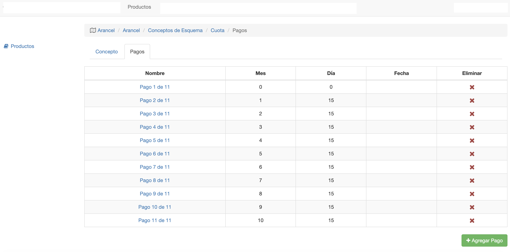

#Pagos de Concepto

Al crear un concepto de esquema, se generan los pagos requeridos para el concepto. Se genera
la cantidad de pagos, de acuerdo al campo *Número de Pagos* del concepto.
Se puede acceder a los pagos de un concepto, en la pestaña Pagos del concepto.

Los pagos se utilizan para generar la/s cuota/s del concepto, al realizar una venta o inscripción.
La inscripción o venta tiene una **fecha desde**. Con la fecha desde y con cada pago, se calculan las
fechas de vencimiento y luego se generan las cuotas.

Cada pago tiene los siguientes campos:

- **Nombre**: El nombre que va a figurar en la cuota generada para el pago.
- **Mes**: Define el mes de la cuota, apartir de la fecha desde.
- **Día**: Define el día de la cuota, en el mes calculado.
- **Fecha**: Opcional, si se desea definir la cuota de manera manual y no calculada
apartir de la fecha desde.

##Ejemplo
Si la fecha desde de una inscripción es 09/02/2022
entonces se puede considerar:

 - Mes 0 o mes inicial como 02 o febrero.
 - Día 0 o día inicial como 09.

Apartir de esta fecha inicial, los pagos definidos generan los
siguientes vencimientos:

 - **Pago 1**: Mes 0, Día 0  => 09/02/2022. Mes 0 y Dia 0 para definir pago misma fecha que fecha desde. 
0 se utiliza para definir misma fecha y/o mes que fecha de inicio:
 - **Pago 2**:  Mes 1, Día 15   => 15/03/2022. Se suma 1 al mes 02 y 15 día del mes calculado.
 - **Pago 3**:  Mes 2, Día 15   => 15/04/2022. Se suma 2 al mes 02 y 15 días del mes calculado.
 - **Pago 4**:  Mes 3, Día 15   => 15/05/2022. Se suma 3 al mes 02 y 15 días del mes calculado.
 - **Pago 5**:  Mes 4, Día 15   => 15/06/2022. Se suma 4 al mes 02 y 15 días del mes calculado.
 - **Pago 6**:  Mes 5, Día 15   => 15/07/2022. Se suma 5 al mes 02 y 15 días del mes calculado.
 - **Pago 7**:  Mes 6, Día 15   => 15/08/2022. Se suma 6 al mes 02 y 15 días del mes calculado.
 - **Pago 8**:  Mes 7, Día 15   => 15/09/2022. Se suma 7 al mes 02 y 15 días del mes calculado.
 - **Pago 9**:  Mes 8, Día 15   => 15/10/2022. Se suma 8 al mes 02 y 15 días del mes calculado.
 - **Pago 10**: Mes 9, Día 15  => 15/11/2022. Se suma 9 al mes 02 y 15 días del mes calculado.
 - **Pago 11**: Mes 10, Día 15 => 15/12/2022. Se suma 10 al mes 02 y 15 días del mes calculado.

##Borrar Pagos

Se puede borrar un pago, haciendo clic en el boton Eliminar del pago.
*Si se borra un pago, no afecta a las cuotas ya generadas de inscripciones o ventas
ya existentes*

##Agregar Pago
Clic en botón **Agregar** para agregar un pago faltante.
*Un pago agregado, no afecta a las cuotas ya generadas de inscripciones o ventas
ya existentes.*

