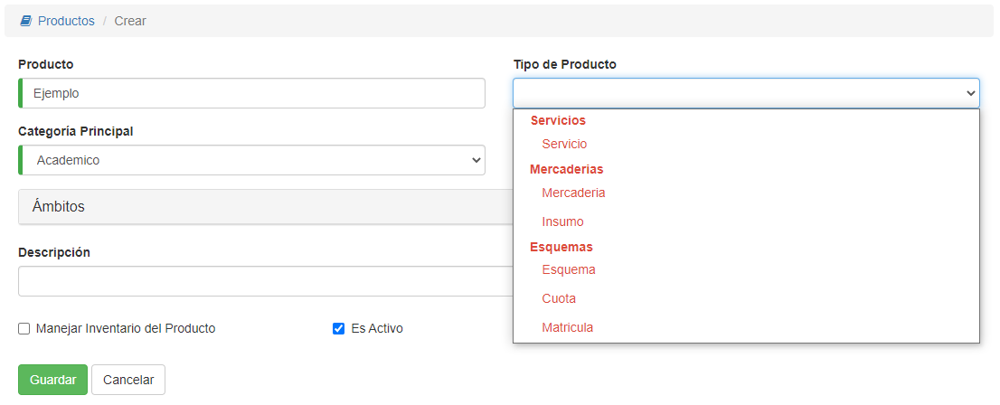

#Precio de Producto
@@toc { depth=1 }
@@@ index
* [Precio Unitario](precio_unitario.md)
* [Precio Concepto](concepto.md)
* [Precio Esquema](esquema.md)
@@@

Dependiendo del **Tipo de producto** escogido, la asignación de precio es diferente:

1. Para los Servicios, Mercaderías e Insumos se asigna un precio unitario. Este precio
   unitario se utiliza para vender los productos de manera individual o por cantidad.
2. Para los Esquemas, se debe crear un precio de tipo esquema, conformado por
   las cuotas, con sus vencimientos, y matrícula. Al venderse un producto de tipo esquema, se genera
   una deuda con las cuotas definidas en el esquema.
3. Para Matrícula y Cuota, los conceptos de esquema, no es necesario asignar precio. Ya que el precio, se asigna via esquema.

