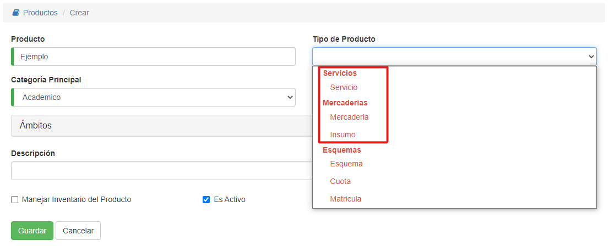
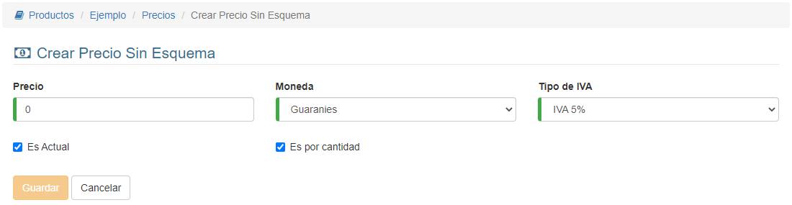

#Precio Unitario

Si escogimos un tipo de producto de las secciones **Servicios** o **Mercaderías**, el sistema requiere que se registre un precio unitario para el producto:

Se denomina unitario, porque seria el precio correspondiente a una unidad del producto. Este precio entonces, se multiplica
por la cantidad vendida, en la operación de venta. Por ej. en la factura de venta.

Los datos para el precio unitario son:

- **Precio**: Se define el monto unitario, iva incluido.
- **Moneda**: Se define la moneda del precio.
- **Tipo de Iva**: Se define el iva que se incluye en el precio.
- **Es actual**: Se marca esta casilla, para establecer el precio como actual. De esta manera
los precios anteriores quedan deshabilitados.
- **Es por cantidad**: Se marca para establecer que el precio es unitario. Dejar marcado
este campo para el precio unitario y desmarcar en caso que sea precio de cuota de esquema.
Luego de completar los datos presionar **Guardar**. Para crear el precio en el sistema.

