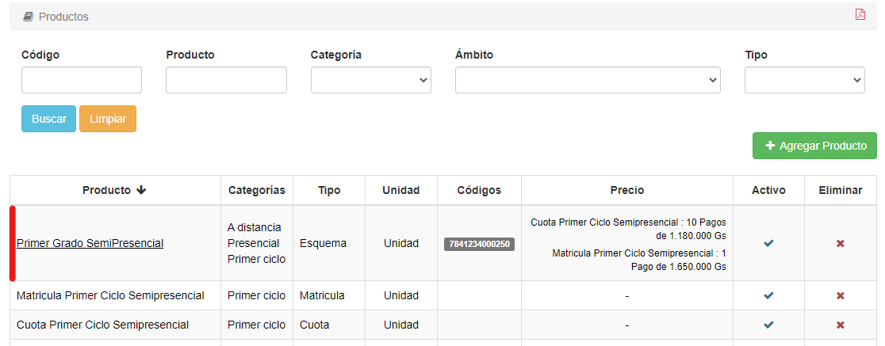
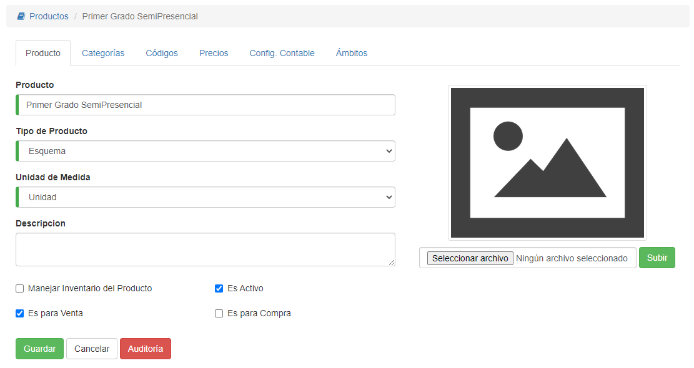
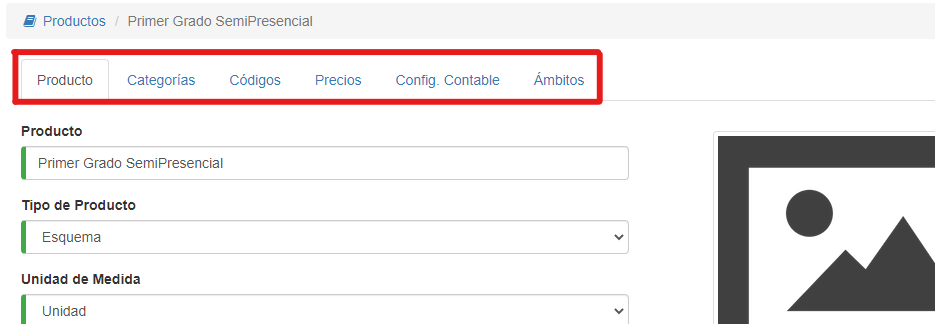

# Editar Productos

@@toc { depth=1 } 
@@@ index
* [Categorías](editar_productos_categorias.md)
* [Códigos](editar_productos_codigos.md)
* [Precios](editar_productos_precios.md)
* [Configuración Contable](editar_productos_configuracioncontable.md)
* [Ámbitos](editar_productos_ambitos.md)
@@@

Una vez estamos en la lista, podemos modificar un registro haciendo clic sobre su nombre:

*Si queremos editar una pestaña específica, hacemos clic sobre su división en el registro correspondiente, es decir, si queremos editar la sección 'Precio', hacemos clic sobre el/los precio/s del producto.*

El sistema mostrará esta interfaz:

Si queremos, podemos modificar los datos y hacer clic en **Guardar**; si no queremos modificar los datos, hacemos clic en **Cancelar**.

En la parte superior, veremos unas pestañas, donde hay más información sobre el producto:

