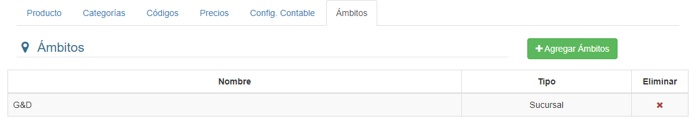
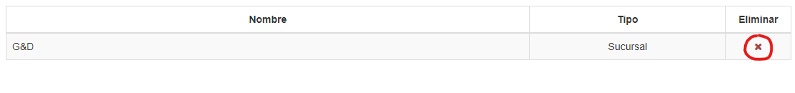
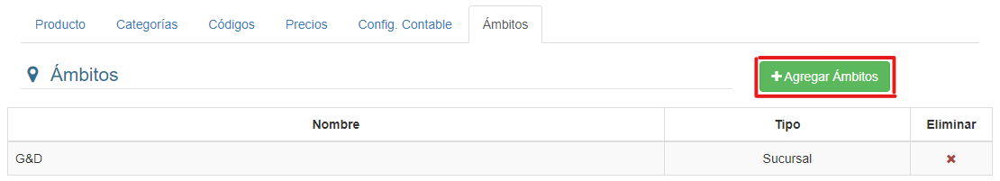
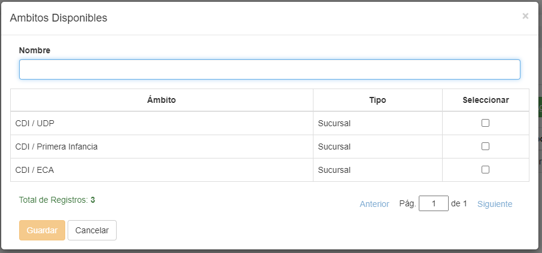
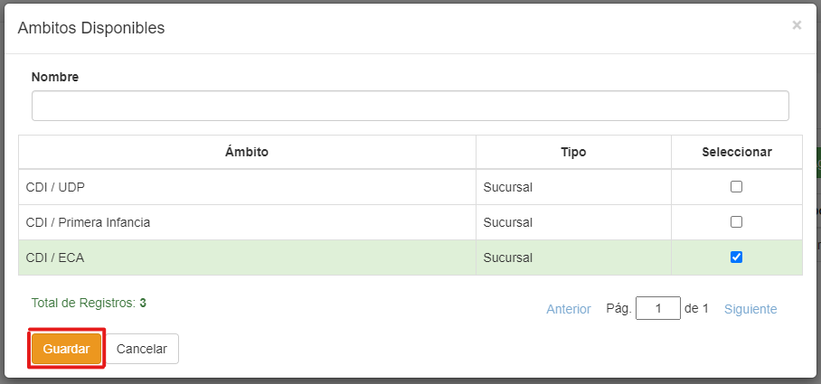

## Ámbitos

Si entramos en la pestaña **Ámbitos**, veremos esta interfaz:

Podemos eliminar un registro haciendo clic en el icono **'X'**, bajo la columna **Eliminar**:

Para agregar un **Ámbito**, hacemos clic en el botón **Agregar Ámbito**:

Luego buscamos los ámbitos deseados y hacemos clic sobre ellos:

Una vez seleccionamos los ámbitos, hacemos clic en **Guardar**:
