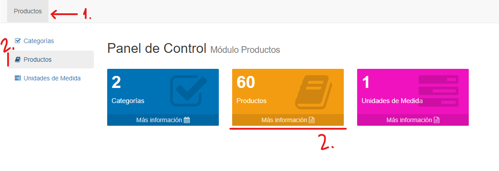

# Productos

@@toc { depth=1 } 
@@@ index
* [Listar Productos](listar_productos.md)
* [Crear Productos](crear_productos.md)
* [Editar Productos](editar_productos.md)
* [Borrar Productos](borrar_productos.md)
@@@

Los productos definen los esquemas, servicios y/o mercaderias para las operaciones de venta y compra.
Cada producto corresponde a un Tipo de Producto, que define su comportamiento en el sistema. 

Para acceder a la funcionalidad de productos, hacemos clic en módulo **Productos** y luego seleccionamos la opción *Productos*, en el menú izquierdo o en el recuadro central:

