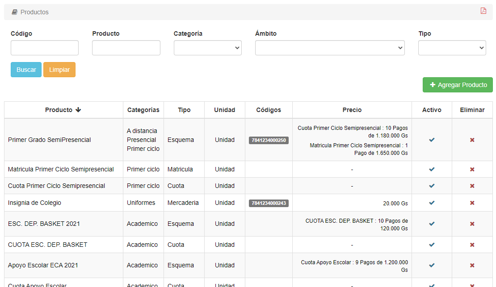
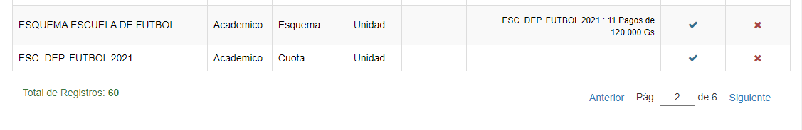
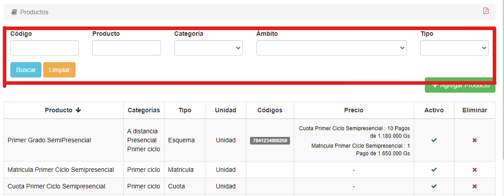
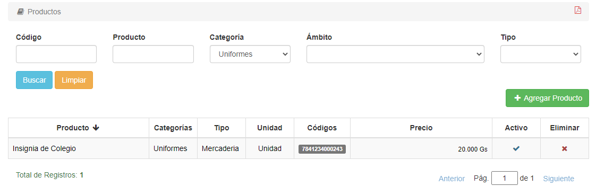

# Listar Productos

Para listar los productos, hacemos clic en la pestaña **Productos** y luego seleccionamos la opción *Productos*, ya sea en el índice izquierdo o en el recuadro central:

El sistema nos listará los productos:

Hay un máximo de diez productos en cada página.
Abajo de la lista se pueden ver la cantidad total de registros y la página actual:

Se puede cambiar de página haciendo clic en *Anterior*, en *Siguiente*, o escribiendo manualmente el número de página.

## Filtrar Productos

En la parte de arriba, se pueden filtrar los resultados de acuerdo a Código, Producto (Nombre), Categoría, Ámbito y Tipo:

*Ejemplo:*

Una vez se ingresan los datos a filtrar, presionamos el botón **Buscar** para que se filtren los resultados. Si queremos borrar los filtros, presionamos el botón **Limpiar**.