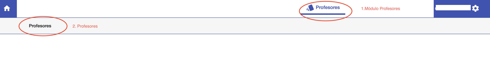
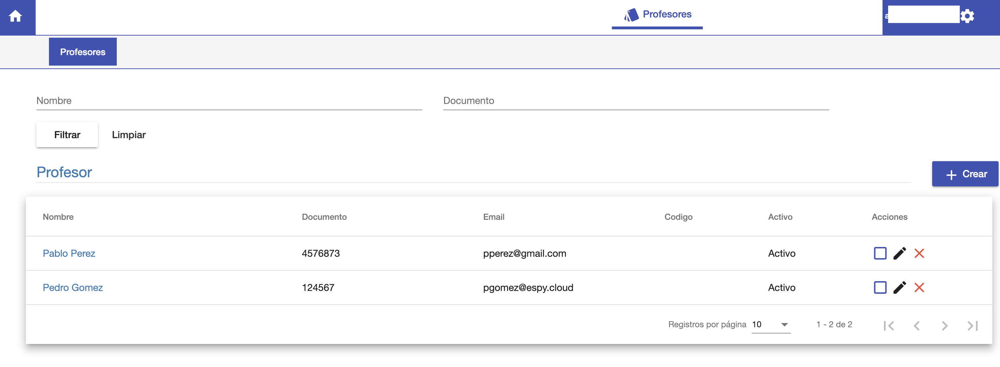

#Acceso a Profesores

Para acceder, en Pioneer:

1. Ingresar primero al módulo **Profesores**.
2. Luego ingresar al submenú del mismo nombre, **Profesores**.

Al acceder, se despliega el listado de los profesores registrados.
Desde esta interfaz se puede:

1. Listar y buscar profesores.
2. Crear profesor.
2. Acceder a la edición de datos académicos de cada profesor.
3. Acceder a la edición de datos personales de cada profesor.
4. Borrar profesor.
5. Activar o Desactivar profesor.

