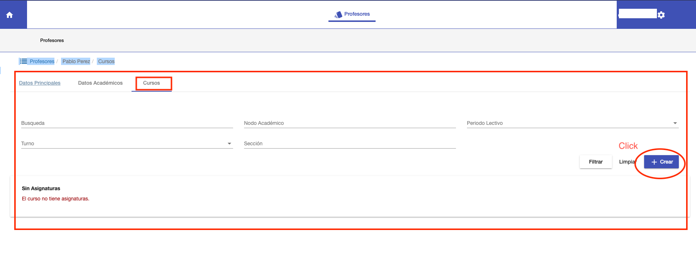
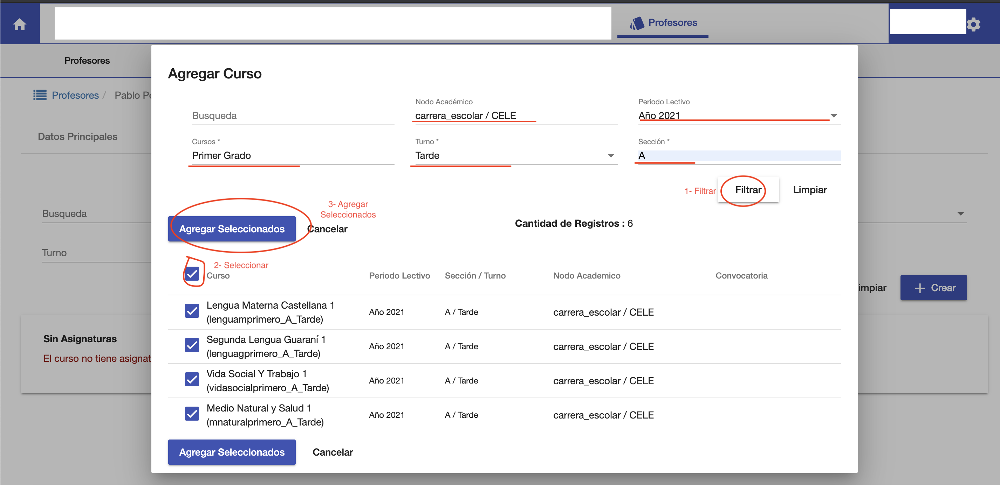
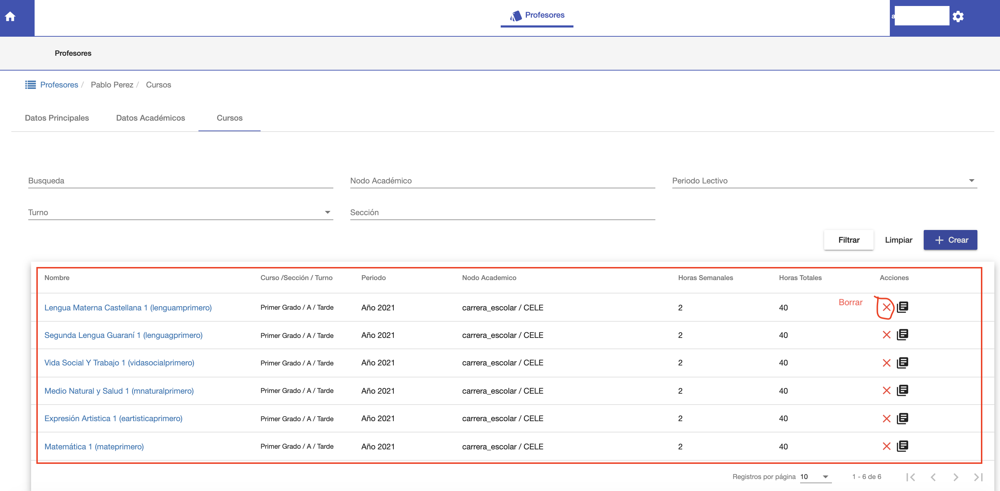

# Editar Cursos

Esta pestaña permite:

1. Asignar cursos, por asignatura, al profesor.
2. Listar y Buscar los cursos asignados al profesor.

##Asignar cursos al profesor

Para asignar  al profesor, click en botón **Crear**.  Y se despliega una ventana donde se pueden
buscar los cursos disponibles para asignar al profesor. Esta ventana tiene filtros para poder buscar y encontrar
los cursos de manera más fácil.
Los filtros son:

* Busqueda: Campo de Texto, donde puede buscarse por nombre de asignatura del curso.
* Nodo Académico: Carrera, donde se da el curso.
* Periodo Lectivo: Periodo Lectivo, Ej 2021.
* Cursos: Permite Buscar por Grado o Curso. Ej 1er Grado, Noveno Grado etc.
* Turno: Permite Buscar por turno.
* Sección: Permite Buscar por sección.

Estos filtros pueden combinarse para hacer una búsqueda más precisa y luego:

1. Click en Filtrar, para buscar los cursos.
2. Seleccionar los cursos encontrados que se requiera.
3. Agregar seleccionados. Para asignar los cursos seleccionados al profesor.

##Listado de Cursos Asignados
Luego de click en Agregar seleccionados, se muestran los cursos asignados
al profesor en la grilla.
Si se requiere pueden asignarse más cursos al profesor o borrar los cursos que no se 
requieren.

