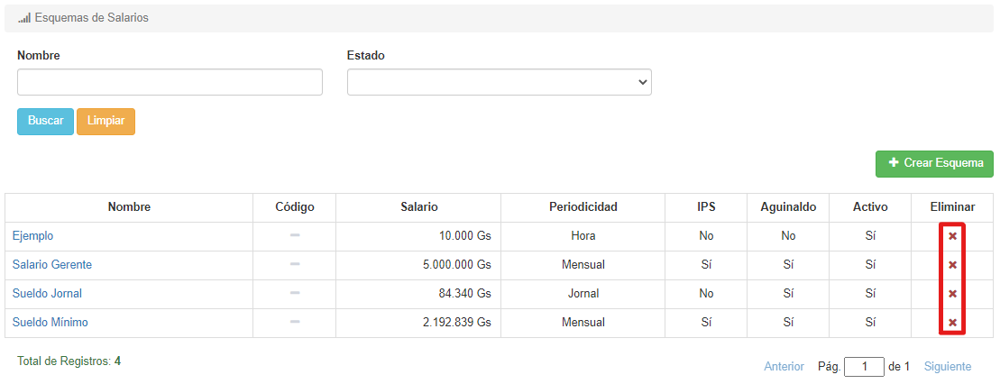

# Borrar Esquemas

Para borrar un esquema, debemos hacer clic en el icono de **'X'** correspondiente al registro que deseamos eliminar. El icono se encuentra bajo la columna **Eliminar**:

El sistema nos pedirá confirmación:

Al hacer clic en **Aceptar**, el esquema será borrado.