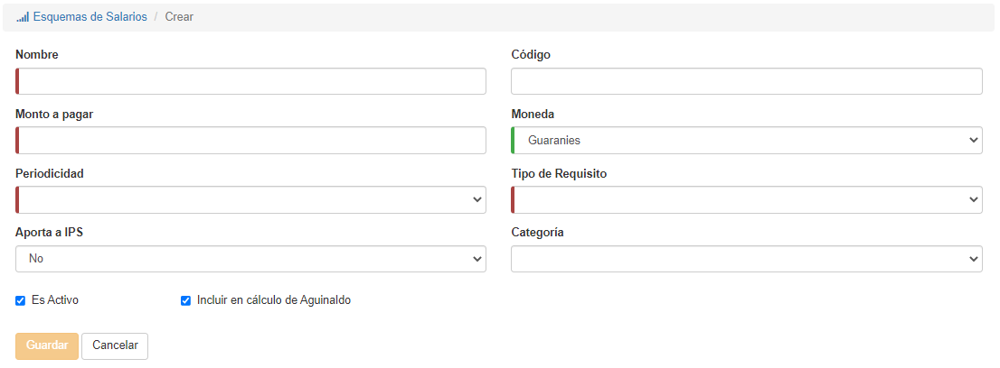

# Crear Esquemas

Para crear un esquema, hacemos clic en el botón **Crear Esquema**:

Al presionar el botón, el sistema nos mostrará el formulario:

Aquí debemos rellenar los datos y hacer clic en **Guardar**. 

*Son obligatorios los campos con una línea roja a la izquierda.*