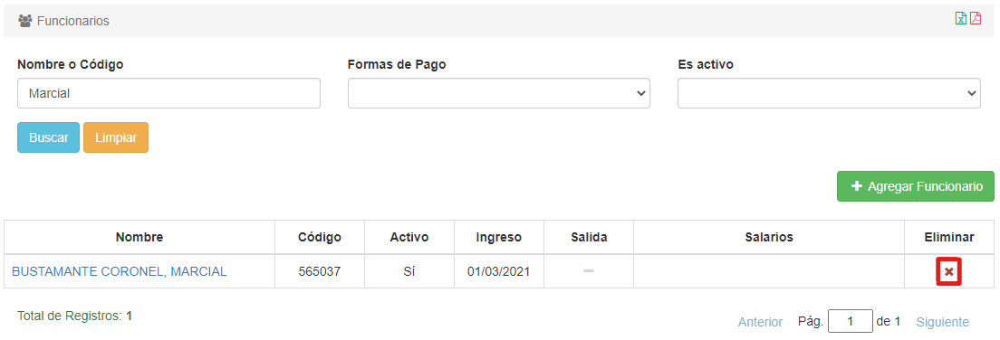

# Borrar Funcionarios

Para borrar un funcionario, debemos hacer clic en el icono de **'X'** del registro que deseamos eliminar. El icono se encuentra bajo la columna **Eliminar**:

El sistema nos pedirá confirmación: Al hacer clic en **Aceptar**, el funcionario será borrado.