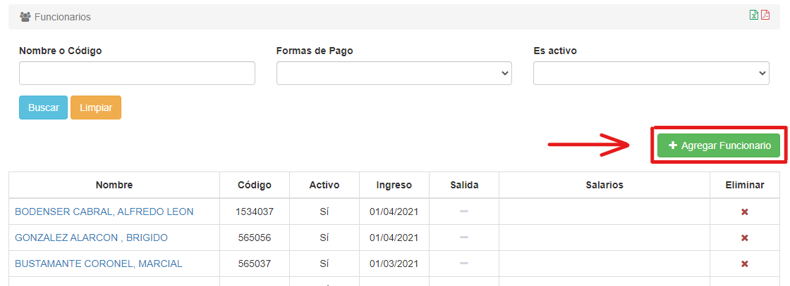
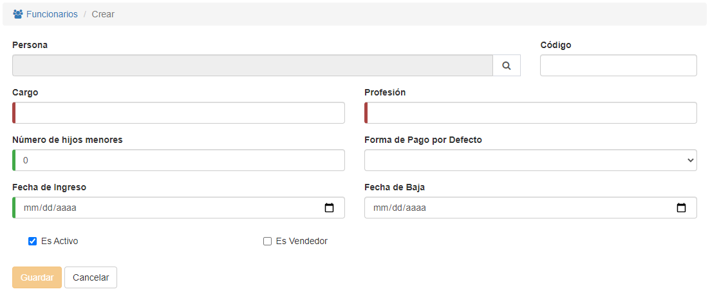
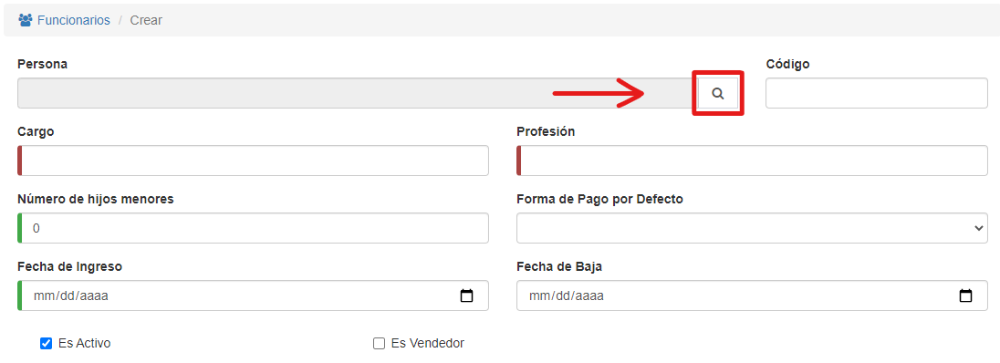
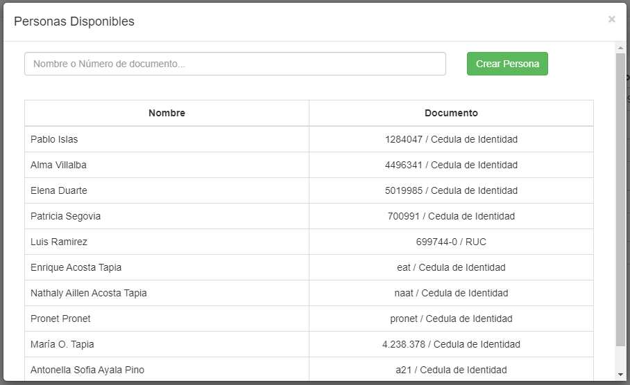
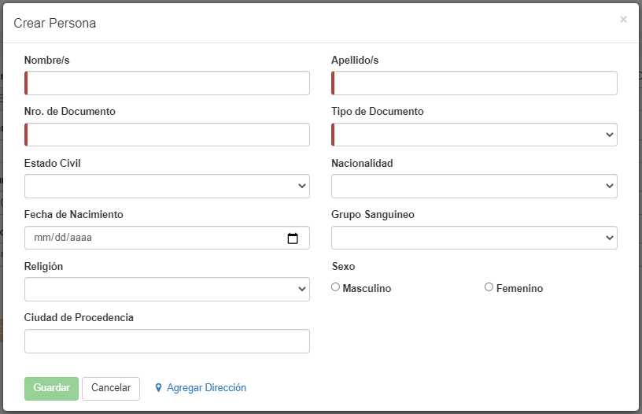
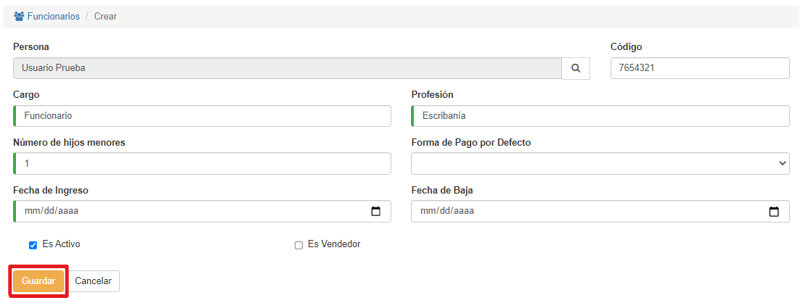

# Crear Funcionarios

Para crear un funcionario, hacemos clic en el botón **Agregar Funcionario**:

*Al presionar el botón:*

Una vez aquí, vamos al menú de búsqueda de personas:

Si la persona que queremos agregar como funcionario ya está registrada, podemos filtrarla (si es necesario) y luego hacer clic sobre ella.

Si la persona no está registrada en el sistema, podemos crearla haciendo clic en **Crear Persona**:

Debemos rellenar al menos los datos requeridos (los que tienen una línea roja al inicio). Al terminar, hacemos clic en **Guardar**.

Cuando hayamos seleccionado a la persona, debemos ingresar (como mínimo) los campos requeridos:

Al finalizar, hacemos clic en **Guardar**.

El funcionario será creado.

*El sistema nos permitirá agregar un Esquema de Salario (opcional), podemos encontrar más detalles en la sección Editar Funcionarios.*