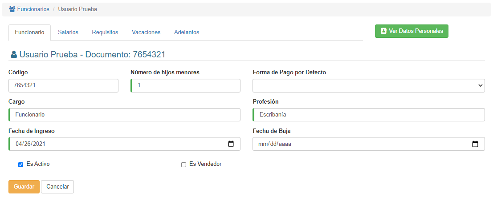
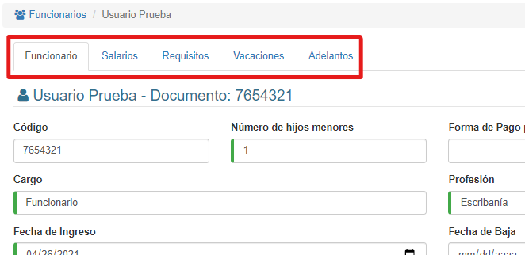
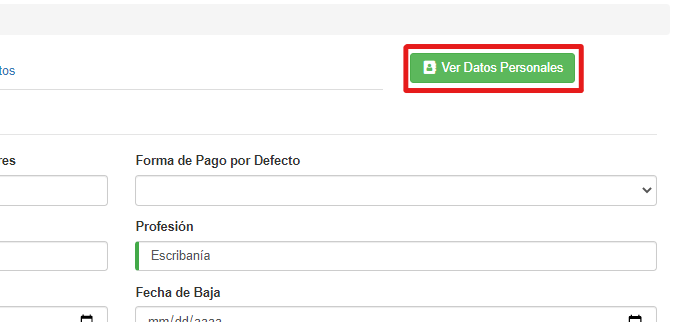

# Editar Funcionarios

@@toc { depth=1 } 
@@@ index
* [Salarios](editar_funcionarios_salarios.md)
* [Vacaciones](editar_funcionarios_vacaciones.md)
* [Adelantos](editar_funcionarios_adelantos.md)
@@@

Una vez estamos en la lista, podemos modificar un registro haciendo clic sobre su nombre:

El sistema mostrará esta interfaz:

De aquí podemos modificar los datos y hacer clic en **Guardar**; si no queremos modificar los datos, hacemos clic en **Cancelar**.

En la parte superior, veremos unas pestañas, donde hay más información sobre el funcionario:

También podemos ver sus datos personales haciendo clic en el botón **Ver Datos Personales**:

