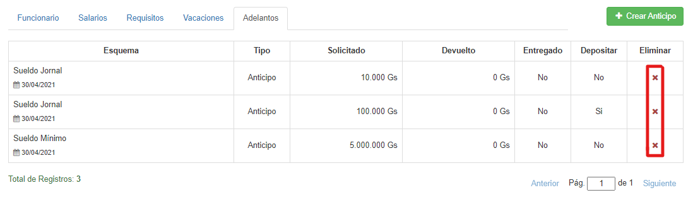

## Adelantos

Si hacemos clic en la pestaña **Adelantos**, veremos esta interfaz:

Podemos ver los detalles de un adelanto haciendo clic sobre él:

Podemos agregar un adelanto al funcionario, haciendo clic en **Crear Anticipo**:

Debemos rellenar el formulario y, al terminar, hacer clic en **Guardar**.

*A tener en cuenta:*

* *No se puede adelantar un monto como parte de aguinaldo, si el aguinaldo es inferior a dicho monto.*
* *Solo se pueden seleccionar los esquemas salariales que ya están asignados al funcionario*

Si queremos borrar un anticipo, debemos hacer clic en el icono de la **'X'** correspondiente:

