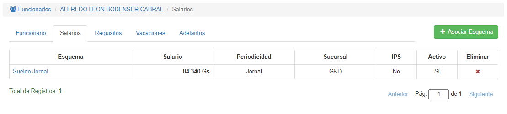
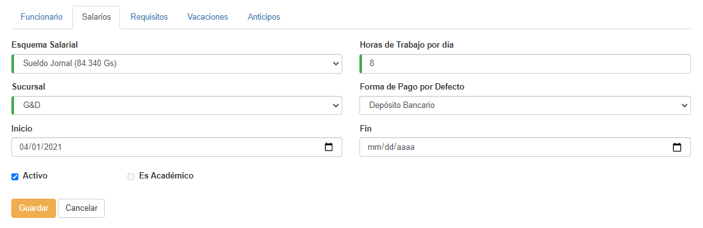
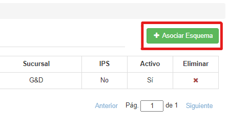
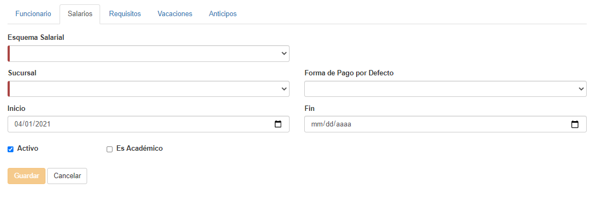
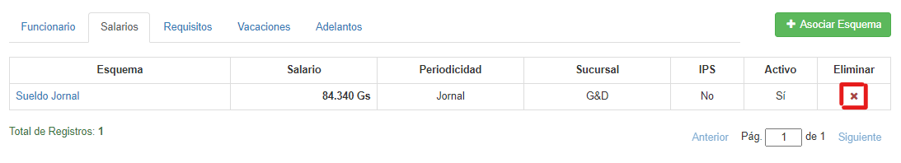

## Salarios
Si hacemos clic en la pestaña **Salarios**, veremos esta interfaz:

Podemos ver un salario específico si hacemos clic sobre su nombre:

Desde aquí podemos modificar el salario y presionar **Guardar**.
Para volver presionamos **Cancelar**.

Podemos agregar un salario al funcionario, haciendo clic en **Asociar Esquema**:

Una vez aquí, debemos seleccionar un esquema salarial, una sucursal, y rellenar los datos deseados. Al finalizar, hacemos clic en **Guardar**.

Si queremos borrar un esquema, debemos hacer clic en el icono de la **'X'** correspondiente:

