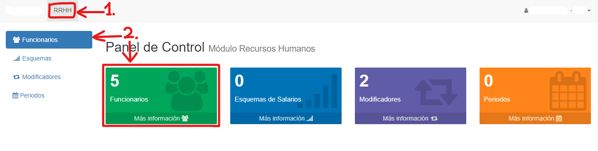

# Funcionarios

@@toc { depth=1 } 
@@@ index
* [Listar Funcionarios](listar_funcionarios.md)
* [Crear Funcionarios](crear_funcionarios.md)
* [Editar Funcionarios](editar_funcionarios.md)
* [Borrar Funcionarios](borrar_funcionarios.md)
* [Generar reportes](reportes_funcionarios.md)
@@@

Los funcionarios comprenden los trabajadores de la empresa.

Para acceder a la funcionalidad de funcionarios, hacemos clic en la pestaña **RRHH** y luego seleccionamos la opción *Funcionarios*, ya sea en el índice izquierdo o en el recuadro central:

