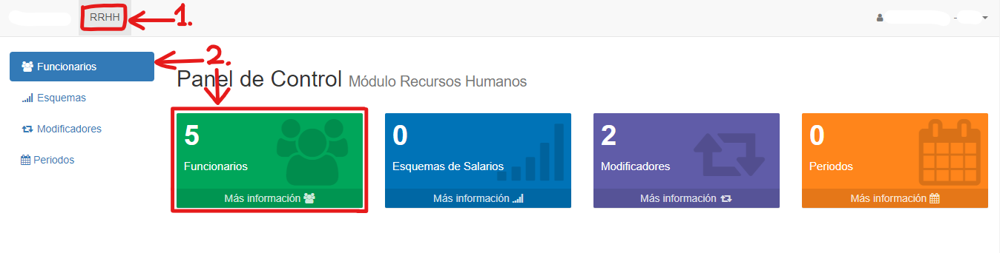

# Listar Funcionarios

Para listar los funcionarios, hacemos clic en la pestaña **RRHH** y luego seleccionamos la opción *Funcionarios*, ya sea en el índice izquierdo o en el recuadro central:

El sistema nos listará los funcionarios:

Hay un máximo de diez funcionarios en cada página.

Abajo de la lista se pueden ver la cantidad total de registros y la página actual.
Se puede cambiar de página haciendo clic en *Anterior*, en *Siguiente*, o escribiendo manualmente el número de página.

## Filtrar Funcionarios

En la parte de arriba, se pueden filtrar los resultados de acuerdo a Nombre (o código), Formas de Pago y si es Activo:

*Ejemplo:*

Una vez se ingresan los datos a filtrar, presionamos el botón **Buscar** para que se filtren los resultados. Si queremos borrar los filtros, presionamos el botón **Limpiar**.