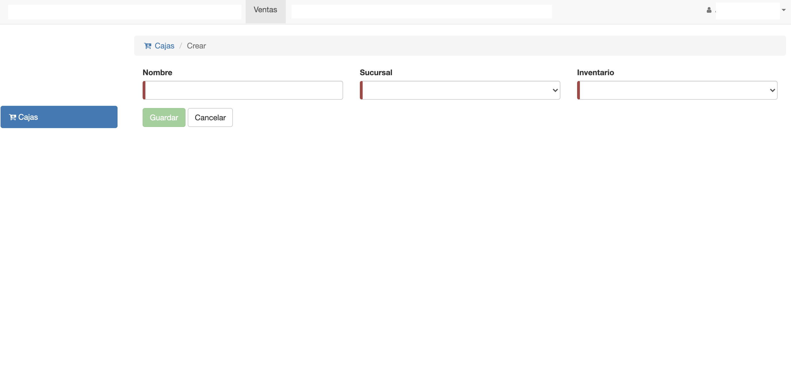

#Crear Caja

Para crear una caja o punto de ventas, clic en el botón *Agregar Caja* de la interfaz
de listado de cajas.

Se despliega la interfaz para crear caja:

Los campos a completar son:

- **Nombre**: Nombre para identificar a la caja.
- **Sucursal**: Se elige la sucursal donde funciona la caja.
- **Inventario**: Se elije el inventario de donde se van a obtener las mercaderías para las ventas de la caja.

Luego de completar los campos clic en *Guardar*. El sistema crea la caja y despliega la pantalla
Editar Caja.

