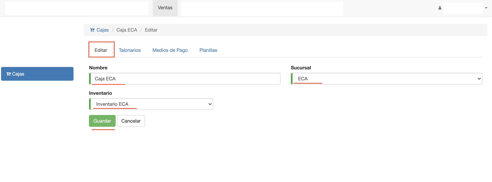

#Editar Caja

La interfaz para editar caja se accede:

 - Desde el listado de cajas. Haciendo clic en la caja que se quiere editar. 
 - Luego de crear una caja, el sistema despliega la interfaz de editar. Para continuar configurando la caja.

Editar caja ofrece las siguientes pestañas:

 - **Editar**: Edición de datos básicos.
 - **Talonarios**: Asignación de talonarios.
 - **Medios de Pago**: Configuración de medios de pago.
 - **Planillas**: Gestión de las planillas de cobranza.

##Editar

La pestaña Editar permite actualizar los datos básicos con los que se
creó la caja.
Si se requiere actualizar estos datos, pueden modificarse y luego clic
en *Guardar*
