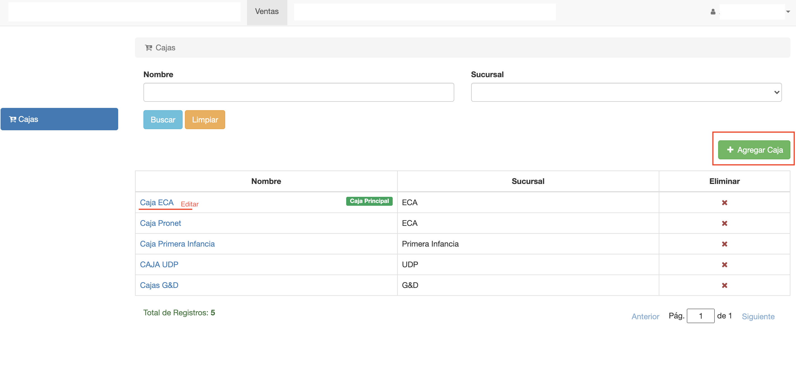

#Cajas

@@toc { depth=1 }
@@@ index
* [Crear Caja](crear_caja.md)
* [Editar Caja](editar_caja.md)
* [Talonarios de Caja](talonarios_de_caja.md)
* [Medios de Pago de Caja](medios_de_pago_de_caja.md)
* [Planillas de Caja](planillas_de_caja.md)
@@@
Las cajas son los puntos de venta, donde se registran las operaciones de venta.

Para gestionar las cajas, ir al módulo de *Ventas* y luego
a la opción *Cajas* del menú de la izquierda.

Se muestra la interfaz de listar cajas. Donde se puede:

- Listar y buscar cajas.
- Crear caja.
- Editar caja.
- Borrar caja.

##Listar Cajas
La grilla muestra el listado de las cajas registradas.
Cada registro muestra:

- **Nombre**: Nombre de la caja.
- **Sucursal**: Sucursal a la que corresponde la caja.
- **Es Principal**: Muestra la caja con la que está trabajando el usuario.

