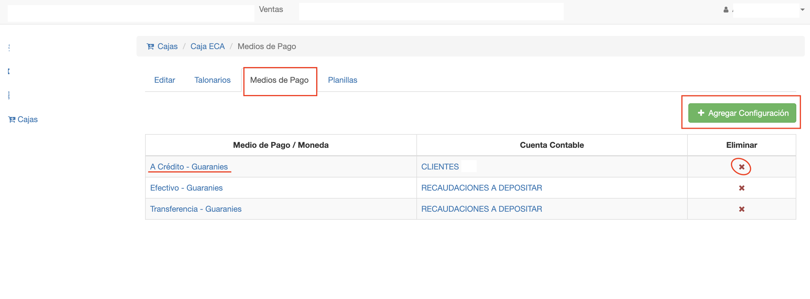
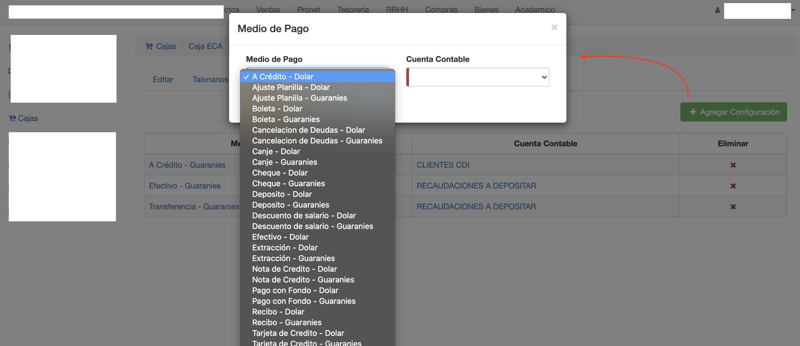

#Medios de Pago de Caja

La pestaña Medios de pago permite configurar los medios de pago
que pueden utilizarse en la caja, para registrar los pagos de facturas
de venta y recibos, emitidas en la caja.

Para acceder a esta funcionalidad, ingresar a la caja y luego ir a la pestaña
*Medios de Pago*.

La interfaz ofrece:

- Un botón para agregar medio de pago.
- Una grilla con los medios de pago ya configurados para la caja.
- Editar medio de pago.
- Un botón para eliminar medio de pago.

##Agregar medio de pago
Para agregar un medio de pago, clic en el botón *Agregar Configuración*
Se muestra una pantalla donde se elije:

-*Medio de pago y Moneda*: El medio de pago que va a habilitarse para la caja. Se elije un par medio de pago y moneda. Por ej: Efectivo en Gs o Efectivo en Dolares. 
-*Cuenta Contable*: La cuenta contable con la que se registran operaciones de ingreso con este medio de pago.

Obs. Las cuentas contables, deben estar definidas en el plan de cuentas de la empresa. Las cuentas
de tipo Caja son las que se pueden utilizar. Las cuentas contables por lo general son de tipo Ingreso.

##Editar medio de pago
Para editar, hace clic en el medio de pago que se quiere editar. Sólo se puede editar
la cuenta contable. De tal manera a que los asientos se generen con otra cuenta.

##Borrar medio de pago
Para borrar un medio de pago de la caja, clic en el botón *Eliminar* del medio de pago que se desea
borrar.

Si se borra un medio de pago, ya no se puede registrar un pago con este medio en las facturas o recibos.

##Medio de pago A Credito
Para poder emitir facturas a crédito. Es necesario configurar en la caja el medio de pago A Crédito.
Si la caja no tiene configurada este medio de pago, no se va a poder emitir una factura a crédito.

