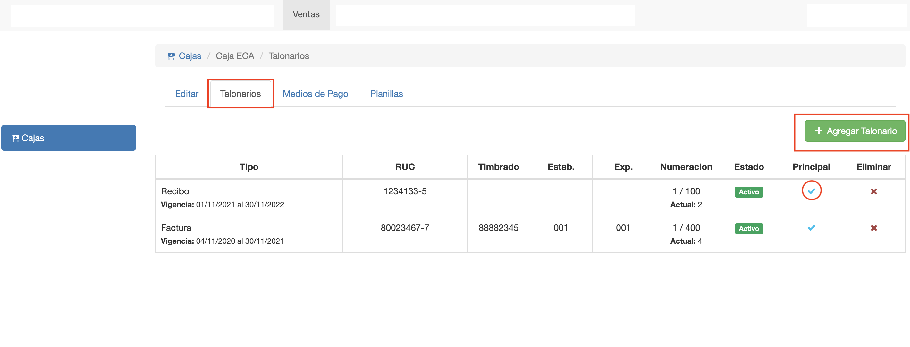
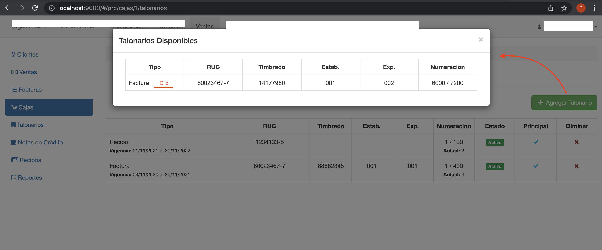
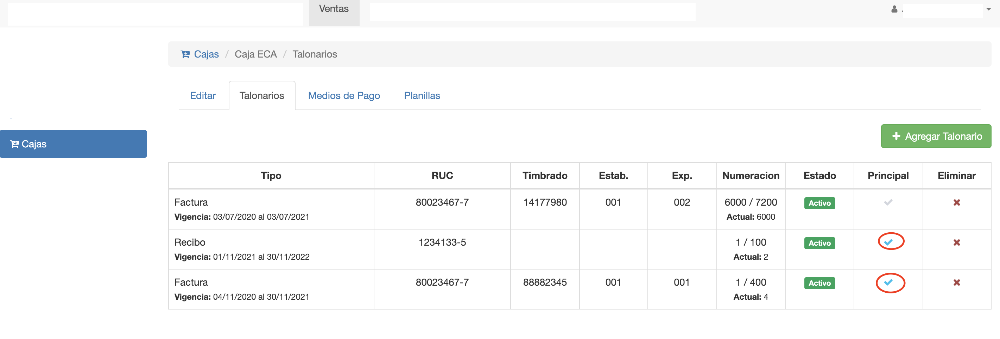

#Talonarios de Caja

En la pestaña Talonarios se pueden asignar los talonarios que se van a
utilizar en la caja.

Al asignar un talonario, la caja va a utilizarlo para emitir comprobantes con la
numeración del talonario.
Al emitir comprobantes, la caja asigna automáticamente el siguiente número disponible. Hasta que se
acaban los numeros del talonario.

Esta pestaña ofrece:

 - Un botón para agregar talonario a la caja.
 - Una grilla con los talonarios ya asignados. Cada talonario muestra el nro actual o siguiente a asignar. Y si es el principal.
 - Un botón para asignar como *Principal* un talonario.

##Agregar Talonario
Se pueden asignar talonarios para:

- Facturas de venta. El talonario se utiliza en Ventas/Facturas.
- Recibos de venta. El talonario se utiliza en Ventas/Recibos.
- Notas de crédito. El talonario se utiliza en Ventas/Notas de Crédito.

Para asignar un talonario clic en *Agregar Talonario* y se despliega un
listado de talonarios disponibles. Luego hacer clic en el talonario disponible que se desea agregar.

Luego de asignar el talonario a la caja. El talonario aparece en el listado de talonarios de la caja.
Aquí se puede marcar el talonario como principal, haciendo clic en la columna Principal. El talonario
principal es el que se utiliza para emitir comprobantes.

*Obs* La emisión se entiendo por la operación de asignar un número del talonario al comprobante, ya sea
factura de venta, recibo de venta o nota de crédito.

##Asignar Talonario Principal
Una caja puede tener sólo un talonario principal de cada tipo. Ya que el sistema debe poder resolver
qué talonario utilizar para las emisiones.
Si una caja no tiene talonario principal para un tipo de comprobante. Va a ocurrir un error al intentar
emitir los comprobantes de ese tipo.
Al marcar un talonario como principal, si existe otro principal del mismo tipo. Este último se *desmarca* automáticamente
como principal.

En la imagen de ejemplo:

- Hay un talonario principal para recibos.
- Hay dos talonarios para facturas. Uno principal, que es el que se usa. Y otro que fue principal y fue reemplazado.
- No hay talonario asignado para Nota de Crédito. Esta caja no va a poder emitir notas de crédito.