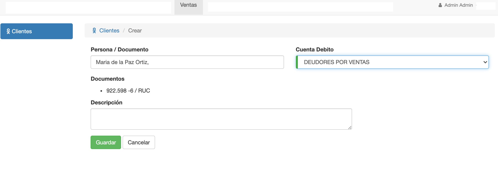

# Crear Cliente

Para crear un cliente, presionamos el botón Nuevo Cliente que aparece en el listado de clientes.

Para crear un cliente se completan los campos:

* Persona / Documento 
* Cuenta Debito

El campo Persona/Documento es un campo autocomplete que permite seleccionar del listado de personas ya creadas y pre seleccionar los campos .
El campo cuenta debito permite asociar las ventas realizadas por el cliente para llevar a cabo los asientos contables.
El Campo descripcion es un campo opcional.

**Observaciones**

* El sistema valida que no se puedan crear cliente con el mismo nro de documento.
