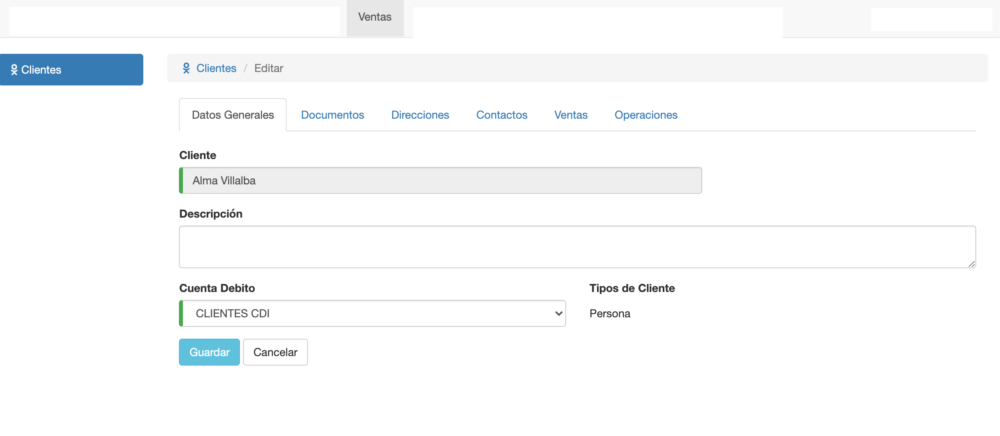
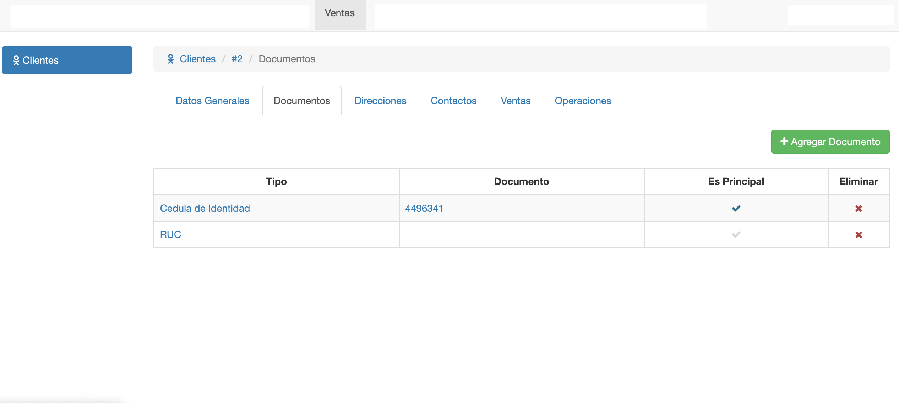
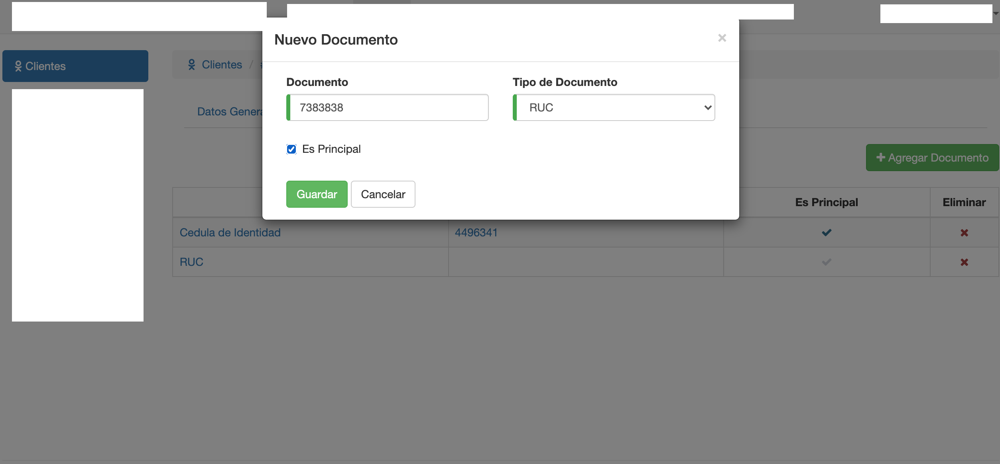
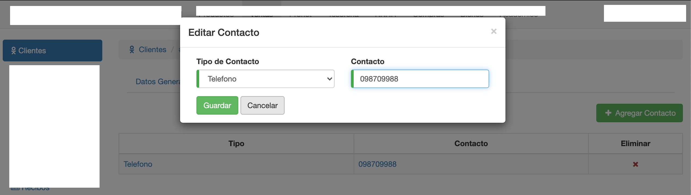

# Editar Cliente

Para editar un cliente, se ingresa al dato del cliente desde la grilla de clientes.

Luego se modifican los campos necesarios y se pulsa el botón Guardar.

Los campos que permite modificar son cuenta debito y descripcion

# Crear Documento Cliente

Para editar o agregar el documento a un clienten , nos situamos en la pestana documento luego presionamos el boton de agregar nuevo.

Para agregar un documento completamos los campos

* Documento 
* Tipo de Documento
* Es principal

El campo documento es principal identifica que el documento seleccionado sea el que va ser utilizado como principal

# Editar Documento de cliente

Para editar un documento seleccionamos el documento que se quiere modificar en la grilla de documentos .
Los campos que permite modificar son:
* Documento 
* Tipo de documento 
* Es principal.

[Editar documento_cliente](./img/editar_documento.png)

#Listado de Direccion

Para verificar el listado de direcciones que tiene registrado el cliente no situamos en la sub-pestana de **direcciones**.
Al ingresar se desplegara una grilla de las direcciones del cliente.

[Listado Direccion](./img/listar_direccion.png)

#Agregar Nueva Direccion 

Para crear una nueva direccion presionamos el boton **Agregar Direccion** que aparece en la grilla de direcciones.

Para agregar la nueva direccion completamos los campos : 

* Direccion
* Es Principal

Los campos opcionales son :

* Nro. Casa/ Dpto
* Descripcion

[Agregar Direccion](./img/crear_direccion.png)
#Editar  Direccion

Para editar una nueva direccion presionamos en la grilla de direcciones la direccion que se desea modificar.

Los campo que permite modificar son :

* Direccion
* Es Principal

Los campos opcionales son :

* Nro. Casa/ Dpto
* Descripcion

[Editar Direccion](./img/editar_direccion.png)

# Agregar Nuevo Contacto de cliente

Para Agregar un nuevo contacto nos situamos en la subpestana de **Contacto** . Luego en el listado seleccionamos el boton **nuevo contacto**

[Agregar Contacto](./img/crear_contacto.png)

los campos que se deben completar son :
* Tipo de contacto 
* contacto

[Agregar Contacto](./img/crear_contacto.png)

# Editar Contacto

Para Editar contacto no  posicionamos sobre el contacto que se quiere modificar en el listado de contactos

Los campos que permite modificar son :

* Tipo de Contacto 
* Contacto

**Observaciones**

* El sistema valida que no se utilicen nombres ya utilizados por otras categorías.
