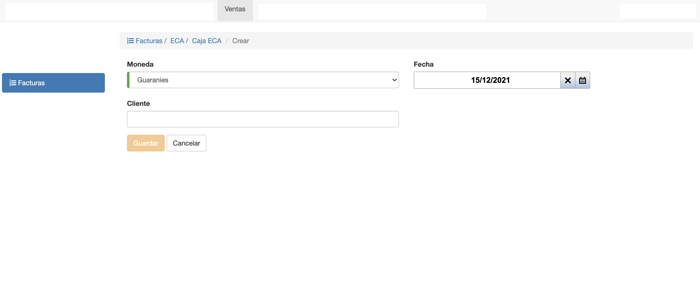
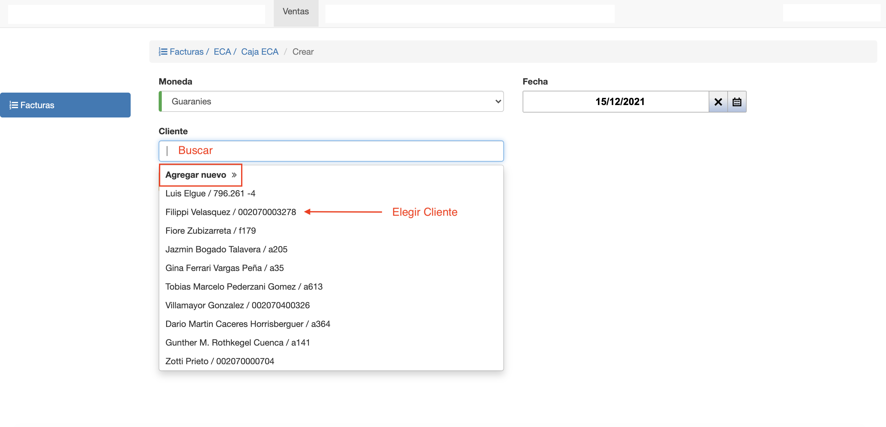

#Crear Factura

Para crear una factura de venta clic en el botón *Agregar Factura* del listado
de facturas.

Se despliega una interfaz con los siguientes campos:

- **Moneda**: Se elije la moneda en la que se va a emitir la factura.
- **Fecha**: Se elije la fecha de emisión de la factura.
- **Cliente**: Se elije o crea el cliente de la factura. Si se van a facturar deudas es importante 
elegir cómo cliente a la persona, organización o familia que tiene las deudas pendientes.

##Buscar o Crear Cliente
El campo Cliente permite:

- Buscar un cliente ya registrado por nombre o documento.
- Si no existe el cliente se puede crear un cliente nuevo. Persona u Organización.

###Crear Persona
Si se quiere asignar a la factura una Persona Nueva entonces:

- Clic en Agregar Nuevo
- Elegir la pestaña Crear Persona y completar los campos requeridos, en rojo:
  - **Nombre/s**: Nombres de la Persona.
  - **Apellido/s**: Apellidos de la Persona.
  - **Nro. de  Documento**: Documento Principal de la Persona.
  - **Tipo de Documento**: Tipo del documento principal, Cédula o Ruc por ej.
- Clic en Guardar. Se crea la persona y queda elegida para crear la factura.

*Obs.* Los demás campos son opcionales y pueden editarse luego. 
### Crear Organizacion
Si se quiere asignar a la factura una Organización/Empresa nueva entonces:

- Clic en Agregar Nuevo.
- Elegir la pestaña Crear Organización y completar los campos requeridos, en rojo:
    - **Nombre**: Nombre de la Empresa.
    - **Nro. Documento**: Nro. de documento principal.
    - **Tipo de Documento**: Tipo del documento.
- Clic en Guardar. Se crea la empresa y queda elegida para crear la factura.

*Obs.* Los demás campos son opcionales y pueden editarse luego.

Por último, se hace clic en *Guardar* para crear la factura.