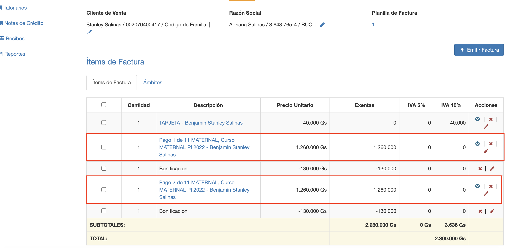
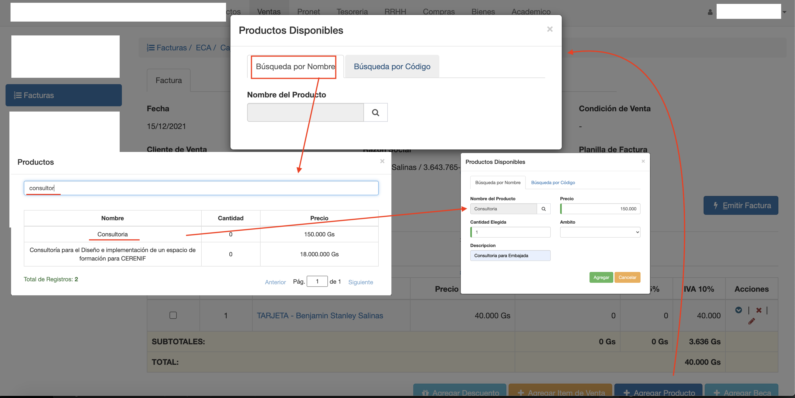
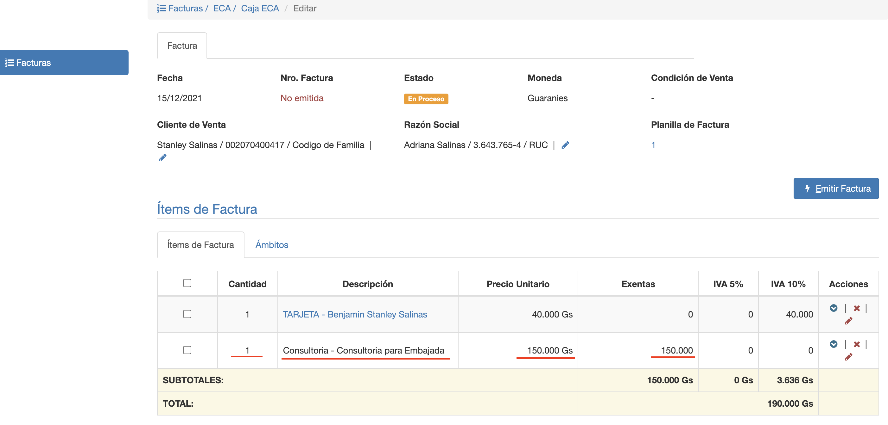
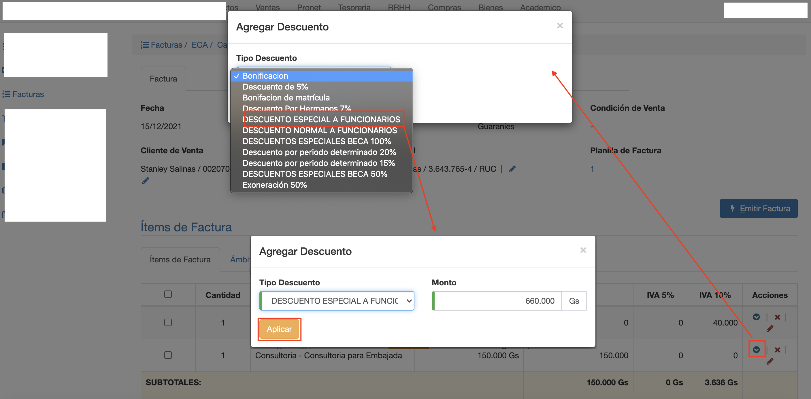
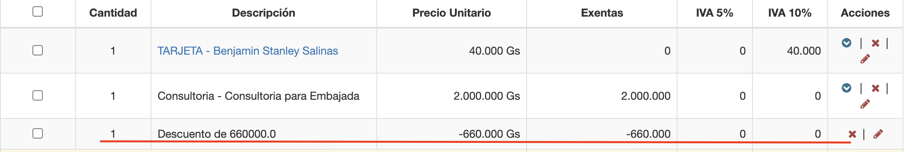
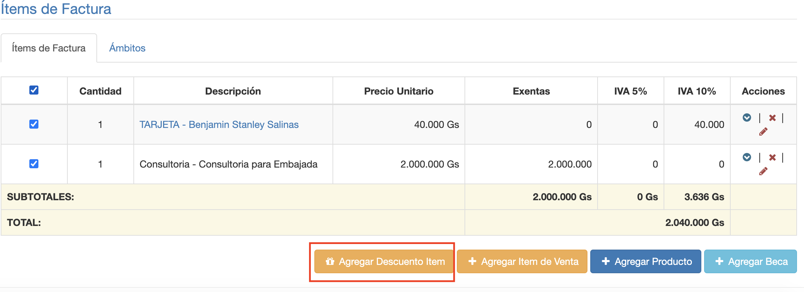
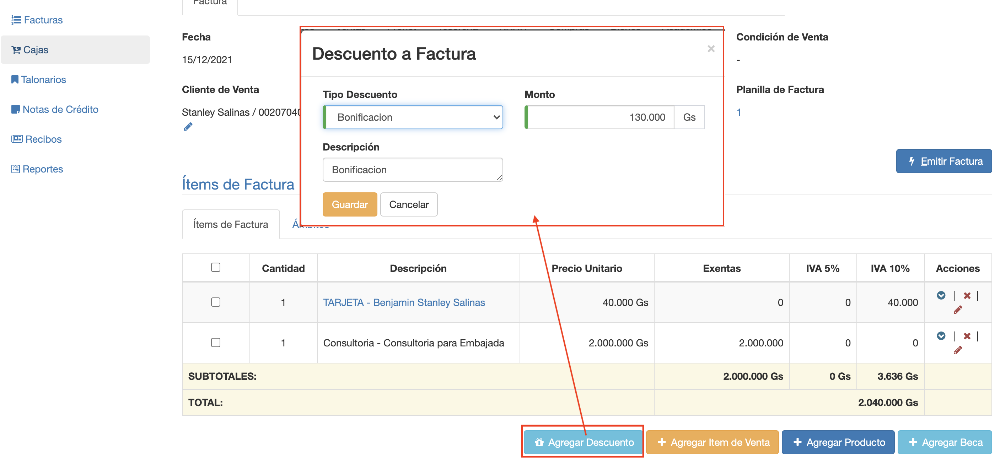

#Editar Items

###Grilla de items de factura.
La grilla muestra los items agregados a la factura.
Cada item tiene los siguientes datos:

**Cantidad**: La cantidad vendida del item.
**Descripcion**: La descripción del item.
**Precio Unitario**: El precio unitario del item IVA incluido.
**Exentas**: El monto exentas aplicado al item.
**IVA 5%**: El monto de iva 5% aplicado al item.
**IVA 10%**: El monto de iva 10% aplicado al item.

Los tipos de items que se pueden agregar son:

- Item de venta. Agregar una deuda del cliente como item de factura.
- Producto. Agregar un producto a la factura.
- Descuento. Agregar un descuento a la factura o para un item.

###Agregar Item de Venta
Para agregar una deuda del ciente, clic en el botón *Agregar Item de Venta*. Y se despliega un listado
de items disponibles, que sonlas deudas pendientes del cliente. Si el cliente es Familia, aparecen las deudas de los miembros
de la familia.

Cada item disponible se lista con los siguientes campos:

- Producto. El producto que generó la deuda.
- Descripción. Detalle o concepto de la deuda.
- Monto. El monto pendiente de la deuda. Puede elegirse el monto total o un monto parcial.
- Vencimiento. Fecha de vencimiento de la deuda.

Se seleccionan los items a agregar y clic en el botón Agregar Seleccionados para agregarlos a
la factura.
El sistema cierra la venta de items disponibles y muestra los items recién agregados en la grilla.

Obs. En este ejemplo cada item agregado tiene un descuento asignado automáticamente. Bonificación por pago
anticipado.

###Agregar Producto
Para agregar un producto directamente en factura, clic en el botón *Agregar Producto*.

Se despliega una interfaz con dos pestañas para buscar los productos:
- Búsqueda por Código.
- Búsqueda por Nombre.

Clic en Búsqueda por Nombre y se muestra un listado donde se puede buscar el producto por nombre.
Luego de elegir el producto se despliega una interfaz donde completar los datos agregar del producto:

- **Precio**: El precio unitario del producto. Se despliega el precio de lista del producto. Que puede modificarse si es necesario en esta interfaz.
- **Cantidad Elegida**: La cantidad a agregar del producto a la factura.
- **Descripcion**: Agregar una descripción para el concepto de la factura.
- **Ambito**: Asignar un ámbito por ej Sucursal para la cual corresponde la venta.

Una vez que se completen los datos necesario, clic en Agregar. Y el producto se agrega como un item
a la factura.

Obs. El precio ya tiene el iva incluido que se configuró en el producto.

###Agregar Descuento
Se puede agregar dos tipos de descuento:

- Descuento por item. Se agrega descuento, por monto o porcentaje, a un item.
- Descuento por factura. Se agrega descuento a la factura, por monto.

Primero se deben definir los descuentos en el módulo Productos/Descuentos. Son estos
descuentos los que se pueden agregar a la factura.

####Descuento por item
Clic en la columna Acciones en el item al que se quiere agregar el descuento. Se despliega una
lista de los descuentos disponibles. Elegir el descuento y luego *Aplicar*.

Se aplica el descuento y aparece debajo del item al que se aplicó. El descuento por item
adquiere el iva del item al que se aplicó.

###Descuento para varios items

Se puede seleccionar varios items de la factura y se habilita el botón *Agregar Descuento Item*.
Clic en este botón para agregar un descuento de una vez a varios items.

###Descuento a factura

Permite agregar un descuento a la factura como un item independiente.
Clic en el botón *Agregar Descuento*, se despliega una interfaz para elegir:

- El Descuento
- Monto
- Descripción

