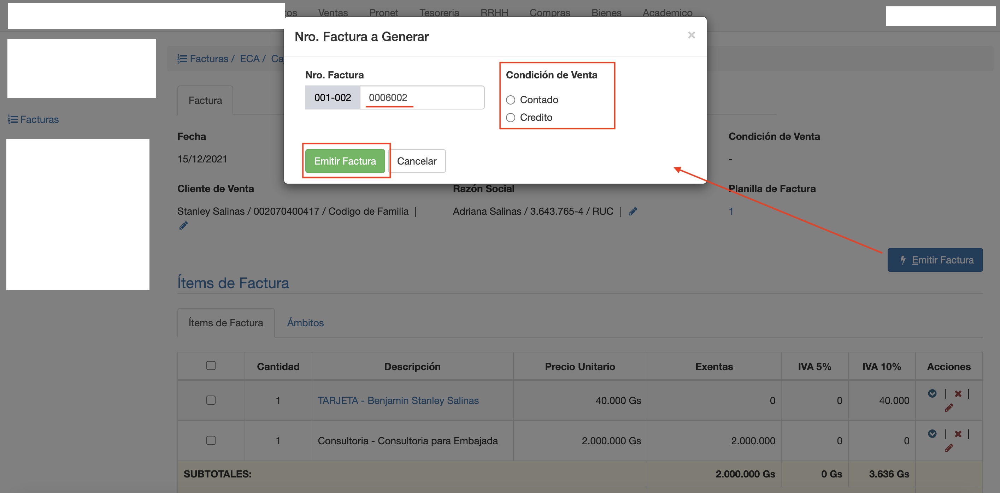

#Emitir Factura

La emisión de factura consiste en:

- Asignar condición de venta: Al Contado o A Crédito.
- Asignar el nro de boleta del talonario, que va a corresponder a esta factura para imprimir.
- Pasar al estado Emitido. Al emitir se confirma la factura y pasa del estado En Proceso a Emitido.

Para emitir, clic en botón *Emitir Factura*. Se despliega la interfaz donde:

- Se elije el Nro de boleta a asignar. Se autocompleta con el nro actual del talonario. Se puede asignar otro Nro disponible del talonario.
- Se elije la condición de venta Contado o Crédito.
- Clic en Emitir Factura para realizar la acción de Emitir.

Luego de emitir,la factura queda en estado Emitido y se habilita la pestaña
Pagos

