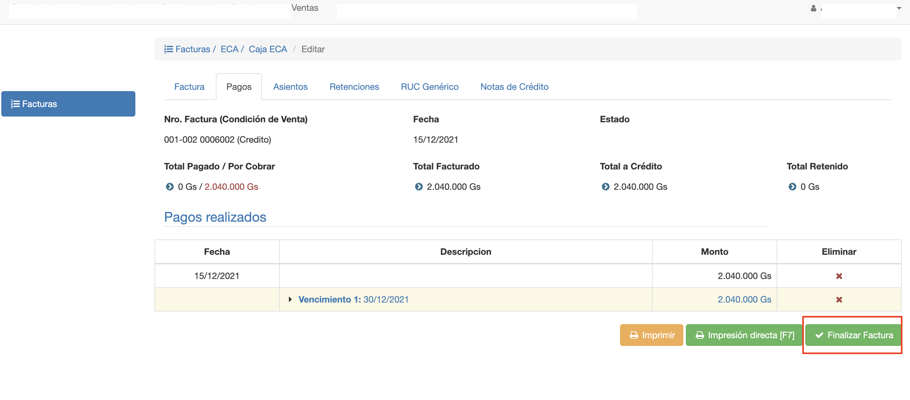
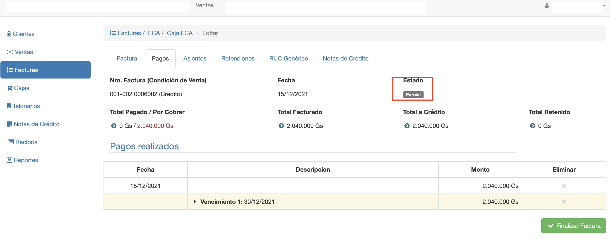

#Finalizar Factura

Se puede finalizar una factura emitida cuando:

- Ya se registraron todos los pagos. Factura Contado.
- Ya se registraron los vencimientos. Factura A Crédito.

Al finalizar una factura, se realizan las siguientes transacciones:

- Factura Contado pasa al estado Finalizado.
- Factura A Crédito pasa el estado Parcial.
- Se actualizan los saldos de las deudas que se incluyeron como items.
- Se genera un asiento contable con los detalles de la factura.

##Finalización de Factura a Crédito
Al finalizar una factura a crédito, pasa al estado Parcial.

Una factura en estado Parcial significa que está pendiente de pagos. Los tadocobros se realizan mediante recibos.
Cuando se cobre la totalidad, la factura pasa al estado Finalizado.
La factura pasa al estado *Finalizado*.

##Finalizacion de Factura Contado

Al finalizar una factura contado pasa directamente al estado Finalizado.

