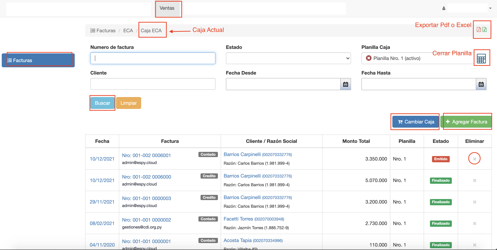
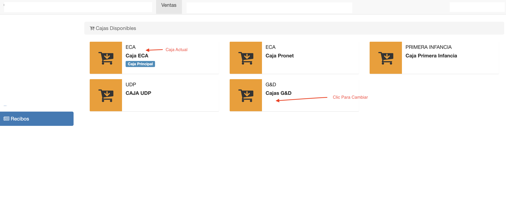

#Facturas

@@toc { depth=1 }
@@@ index
* [Planilla de Caja](planillas_de_caja.md)
* [Crear Factura](crear_factura.md)
* [Editar Factura](editar_factura.md)
* [Emitir Factura](emitir_factura.md)
* [Pagos de Factura](pagos_de_factura.md)
* [Finalizar Factura](finalizar_factura.md)
* [Asientos](asientos.md)
@@@

El sistema permite el registro de facturas de venta. La factura es en un comprobante de
venta, que se emite con un Nro. de boleta legal, Nro. que se asigna mediante el sistema.  
Cada factura de venta se registra para un cliente y puede ser una venta al contado o a crédito.
En el comprobante se pueden incluir:

- Deudas del cliente.
- Productos que adquiere el cliente.
- Descuentos correspondientes al cliente.

Cada factura se registra en una caja. La factura requiere una rendición de la forma de pago, que consiste en registrar
los medios de pago de la factura. Los pagos se asocian a una planilla de caja que se utiliza para el arqueo.

Al finalizar el registro de una factura, se genera un asiento contable de manera automática.

Para acceder, clic en el módulo *Ventas* y luego ir a la opción *Facturas* del menú de la izquierda.
Se despliega el listado de facturas de la caja que se está usando, la caja principal.

##Listado de facturas

La interfaz de listado ofrece:

- Listado y Búsqueda de facturas de la caja en uso.
- Exportar Listado a pdf o excel.
- Cambiar Caja. Permite elegir otra caja y mostrar las facturas.
- Borrar Factura. Permite borrar una factura.
- Cerrar y Exportar Planilla de caja.
- Agregar Factura. Permite crear una factura en la caja.
- Acceder a Factura para editar.

La grilla muestra los siguientes datos de cada factura:

 - **Fecha**: La fecha de emisión de la factura de venta.
 - **Factura**: Nro de factura, si ya fue emitida. También muestra el usuario que registró la factura.
 - **Cliente/Razón Social**: Muestra el cliente de la factura y la razón social para la que se emitió la factura.
 - **Monto Total**: Monto total de venta iva incluido de factura.
 - **Planilla**: Planilla de caja a la que se asocia la factura.
 - **Estado**: El estado de la factura. Puede ser; En Proceso, Emitido, Finalizado, Parcial o Anulado.

##Busqueda

Para buscar facturas, se ofrecen los siguientes campos de búsqueda:

 - **Numero de factura**: Permite buscar por el nro de factura, se debe utilizar el nro sin el prefijo. Por ej para buscar la
factura 001-002 000**6001** buscar con 6001.
 - **Estado**: Permite buscar las facturas por estado.
 - **Planilla de Caja**: Permite buscar las facturas por planilla.
 - **Cliente**: Permite buscar las facturas por cliente.
 - **Fecha Desde**: Para buscar las facturas con fecha mayor o igual a la fecha elegida.
 - **Fecha Hasta**: Para buscar las facturas con fecha menor o igual a la fecha elegida.

Al hacer clic en *Buscar*, se realiza la acción de búsqueda en el sistema y los resultados se muestran
en la grilla.
El sistema combina los campos de  busqueda seleccionados. Y retorna los resultados
que satisfacen a todos los campos enviados.

Para restablecer o vaciar los campos de búsqueda, hacer clic en *Limpiar*.

##Cambiar Caja
Para listar las facturas de otra caja, hacer clic en el botón Cambiar Caja.
Se despliega el listado de cajas, donde se muestra la actual Caja Principal. Clic sobre
la caja que se quiere marcar como Caja Principal y el sistema vuelve al listado de Facturas, mostrando
las facturas de la caja elegida.

##Borrar Factura
Para borrar una factura, pulsar el botón de la columna Eliminar de la factura que se quiere borrar.
Este botón se habilita cuando la factura está en estado En Proceso.

No se puede borrar una factura que ya fue emitida. Sólo se puede anular.

