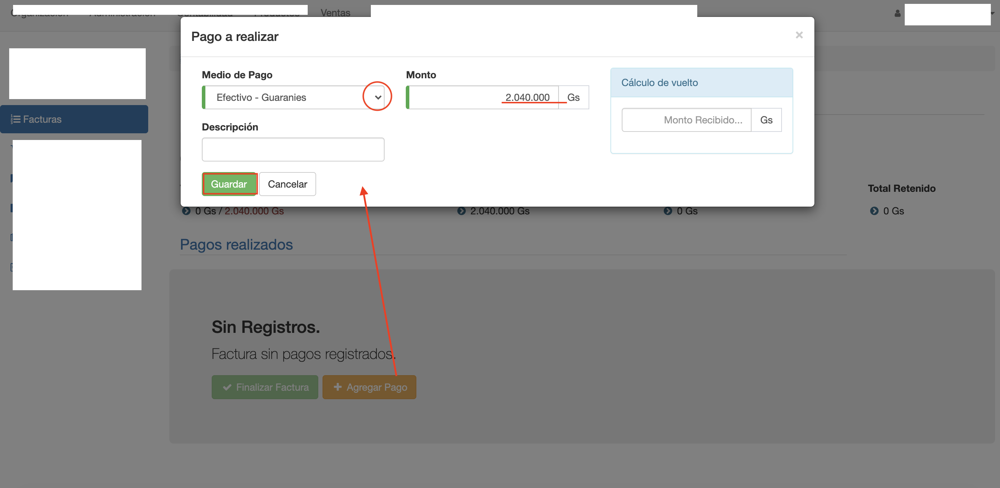
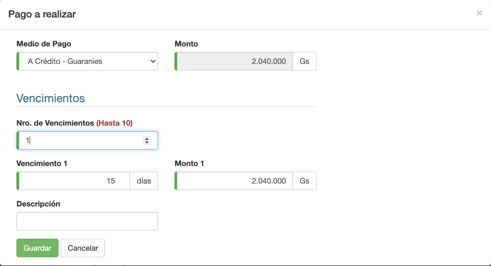

#Pagos

En la pestaña Pagos, se registran los pagos que se recibieron
como cobro por el monto total de la factura.

La pestaña Pagos permite:

- Agregar pagos.
- Listar pagos cobrados en factura.
- Borrar pagos.

##Agregar Pagos

En un factura se pueden agregar varios pagos, con los medios de pago
configurados para la caja de la factura.
Cada pago agregado, se adjunta a la planilla de caja de la factura. De tal manera a que los
pagos figuren en el arqueo de caja de la planilla.

Para agregar un pago:

1. Clic en Agregar Pago y se despliega la interfaz para elegir el medio de Pago.
2. Elegir el medio de Pago y completar los datos, de acuerdo al medio de Pago.
3. Completar el Monto a Pagar. Monto pagado con el medio de pago.
4. Clic en Crear Pago para agregar el pago a la factura.

Obs. Un pago se puede agregar cuando el recibo está en estado Emitido.

##Listado de Pagos
Luego de agregar un pago:

1. Se actualiza la grilla con los pagos de la factura.
2. Se actualizan los totales:
- Total Pagado: Muestra la suma de todos los pagos.
- Total Por Cobrar: Muestra el monto pendiente por pagar.

Cada pago se muestra en la grilla con sus datos, por ej; monto, medio de pago, moneda etc.

Cuando ya se pagó el monto total, el Total Por Cobrar queda igual a 0. Entonces se puede
Finalizar la factura.

##Borrar Pagos
Para borrar un pago, clic en la columna Eliminar del Pago.
Al borrar un pago, se actualizan los totales:

- Se resta el monto del Total Pagado.
- Se suma el monto al Total Por Cobrar.

Al borrar un pago, se borra también el pago de la planilla de caja.
Obs. Un pago se puede borrar cuando el recibo está en estado Emitido.

##Pago para factura a crédito
La factura a crédito sólo permite agregar el medio de pago de tipo A Crédito.
Este medio de pago permite configurar el vencimiento de la factura.
Los cobros de una factura a crédito se registran mediante recibos. Ver Ventas/Recibos.
Luego de registrar el vencimiento de la factura a crédito se puede Finalizar la Factura.

