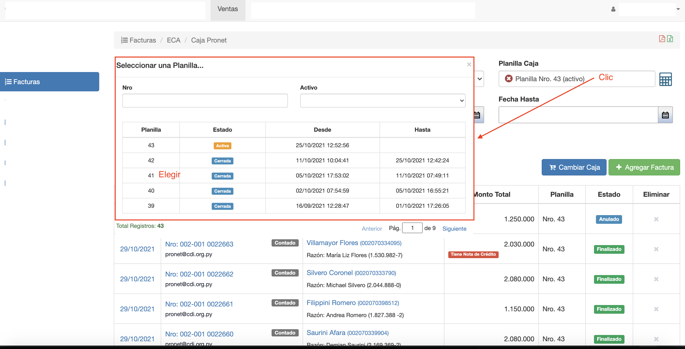
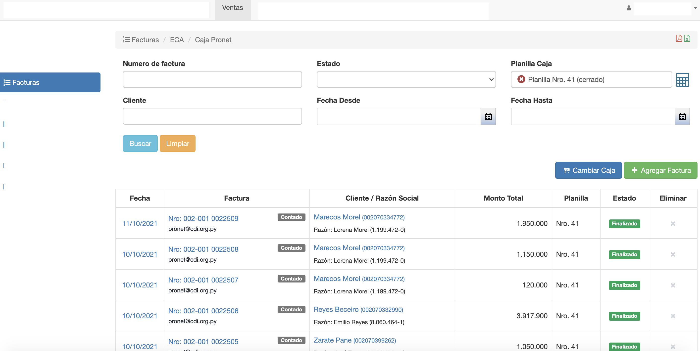
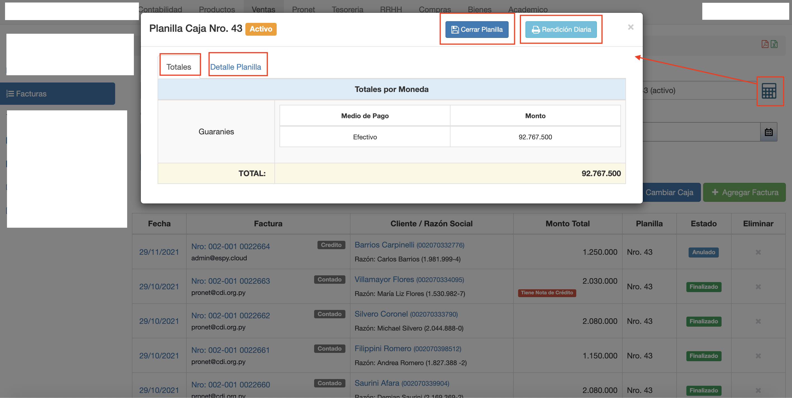
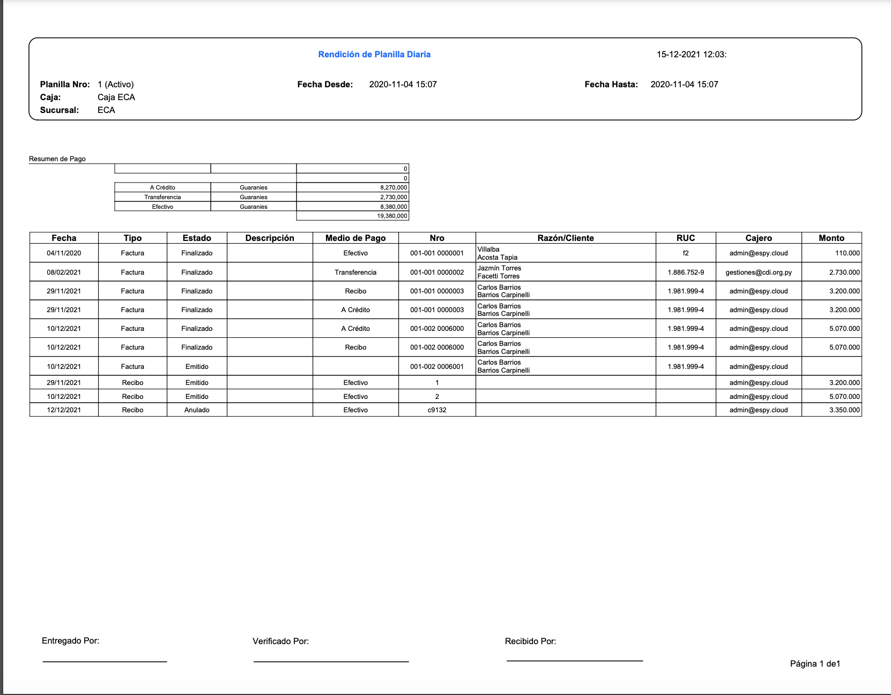

#Planillas de Caja

Desde el listado de facturas se puede:

- Buscar y seleccionar planilla.
- Visualizar y Exportar Rendición diaria.
- Cerrar Planilla.

##Buscar y seleccionar planilla

Para cambiar la planilla:

 - Clic en el campo Planilla Caja del buscador.
 - Se despliega un listado de las planillas de la caja. En este listado se puede buscar la planilla por; Nro de Planilla o Activo Si o No.
 - Elegir la planilla del buscador.
 - Se actualiza el campo Planilla Caja con la planilla elegida y la grilla muestra las facturas de la planilla elegida.

##Visualizar y Exportar Rendición diaria

Para visualizar datos de la planilla elegida, clic en el botón de visualizar planilla.

Se despliega una interfaz con:

- Una pestaña con el total recaudado en la planilla.
- Una pestaña con los detalles de los pagos de la planilla.
- Botón Rendición Diaria, para exportar la planilla en formato PDF.
- Botón Cerrar Planilla, para cerrar la planilla.

El botón Rendición Diaria permite exportar el arqueo de caja de la planilla en formato PDF.

##Cerrar Planilla de Caja

Las facturas se agregan a la planilla activa de la caja. Para cerrar una planilla activa
clic en el botón Cerrar Planilla. La planilla pasa al estado Cerrado. 
En una planilla cerrada ya no se puede agregar facturas nuevas.
Si se crea una factura nueva, en una caja cuya última planilla está cerrada. El sistema genera una nueva
planilla automáticamente, con el Nro siguiente y en estado Activo.
