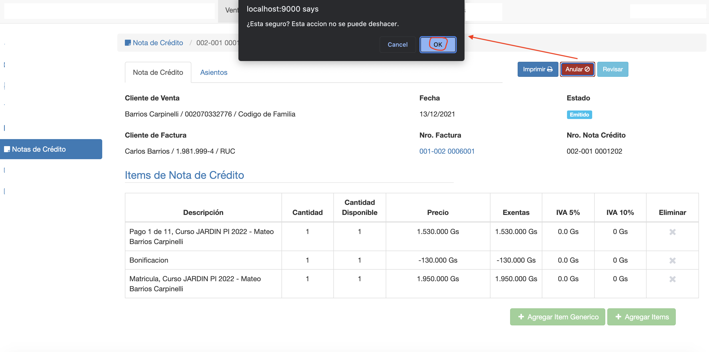
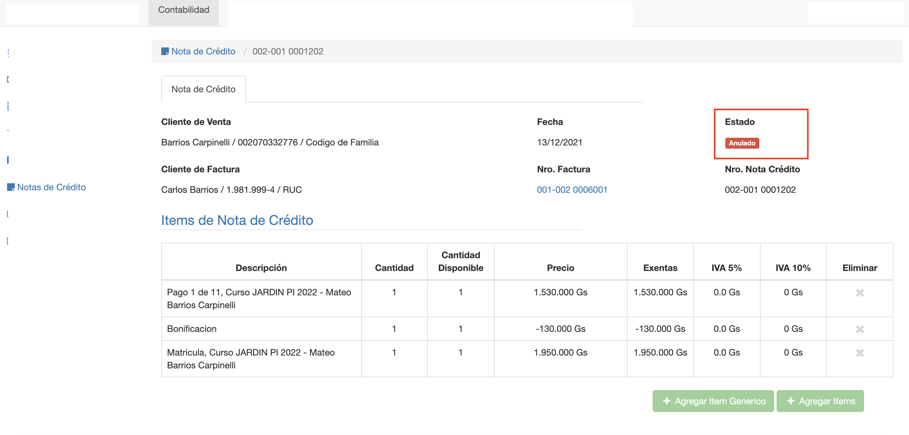

#Anular Nota de Crédito

Una nota de crédito ya emitida, ya no se puede borrar. Debido a que ya se generó el asiento contable.
Entonces lo que se puede hacer es anular la nota de crédito.
La anulación de la nota de crédito:
- Cambia el estado de la nota de crédito a Anulado.
- Restablece los pagos de los items de facturas. Vuelve a aplicar los pagos a los items que correspondan, que se pagaron en la factura.
- Crea un contraasiento para anular el asiento contable.

Para anular la NC clic en el botón *Anular*, el sistema pide confirmación y luego de confirmar se ejecuta la
acción de anular la NC.
El sistema muestra la nota de crédito en estado anulado y en la pestaña Asientos se puede acceder y verificar el
contraasiento.

