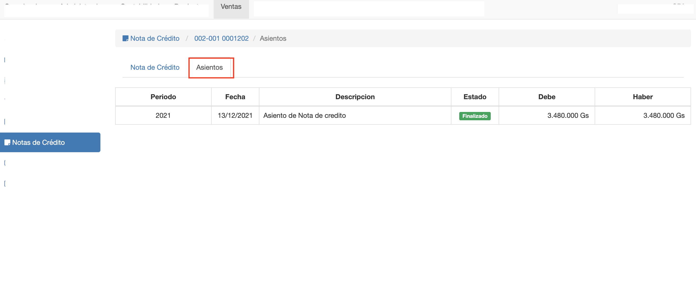

#Asientos de Nota de Crédito

La emisión de la nota de crédito genera un asiento contable.
Para visualizar el asiento generado, clic en la pestaña Asientos, que aparece cuando
la nota de crédito está en estado Emitido.

El asiento contable se genera en el periodo lectivo que corresponde a la fecha de la nota de crédito.
Los detalles del asiento se generan de la siguiente manera:

- Un detalle Debe por cada item de la nota de crédito que anule un ingreso en la factura.
- Un detalle Haber para la cuenta del cliente que aumente el crédito al cliente.