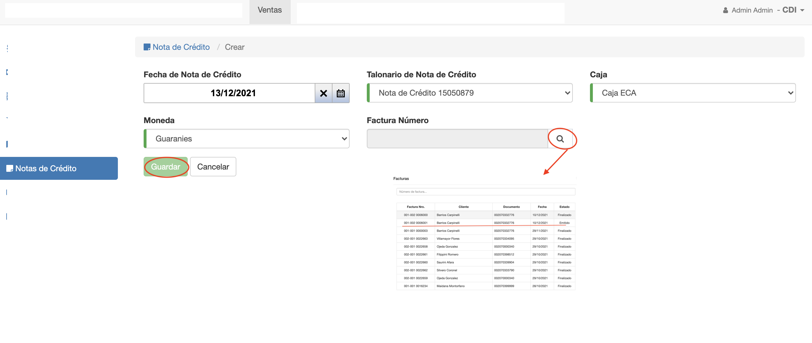
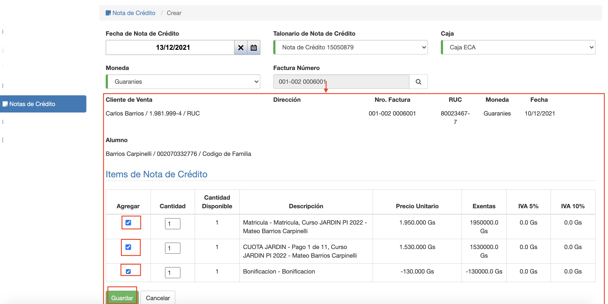

#Crear Nota de Crédito

Para crear una nota de crédito clic en el botón *Agregar Nota de Crédito* del listado.
Se despliega una interfaz con los campos necesarios para crear:

- **Fecha de Nota de Crédito**: Fecha de emisión de la nota de crédito.
- **Talonario de Nota de Crédito**: Se debe elegir qué talonario de nota de crédito utilizar. El talonario
de nota de crédito se debe haber registrado previamente en *Ventas/Talonarios*. Sólo se listan los talonarios activos.
- **Moneda**: Se elije la moneda de la nota de crédito. Debería ser la misma moneda que la factura a la que se va a aplicar.
- **Factura Número**: Campo para elegir la factura a la que se va a aplicar la nota de crédito.Se listan las facturas en estado; Emitido o Finalizado.

Luego de completar los campos, clic en *Guardar*:

1. Se despliegan, en un primer paso, los items de la factura para poder elegir, qué item/s incluir en la
nota de crédito.
2. Se elijen los items a incluir en la nota de crédito.
3. Se hace clic en Guardar y se crea la factura.

Obs. La nota de crédito creada queda en el estado En Proceso. Estado en que puede modificarse y borrarse todavía.

