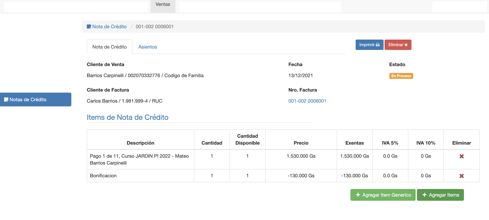

#Editar Nota de Crédito

Luego de crear una nota de crédito o hacer clic en una nota de crédito en el listado, el sistema
despliega la interfaz para editar la nota de crédito.

La interfaz tiene dos pestañas:

1. Nota de Crédito.
2. Asientos.

##Nota de Crédito
La pestaña nota de crédito ofrece:

 - Una cabecera con los datos de la nota de crédito.
 - Una grilla con los items de la nota de crédito. En la grilla se puede editar y borrar items.
 - Un botón para Agregar Item de Factura a la nota de crédito.
 - Un botón para Agregar Item Genérico a la nota de crédito.
 - Un botón para Imprimir nota de crédito.
 - Un botón para Borrar nota de crédito.

### Cabecera
La cabecera muestra los siguientes datos:

-**Cliente de Venta**: El cliente de la factura a la que corresponde la NC.
-**Cliente de Factura**: La razón social de la factura a la que corresponde la NC.
-**Fecha**: Fecha de emisión de la NC.
-**Nro. Factura**: Nro de la factura a la que se asignó la NC. Clic para navegar a factura.

###Grilla
La grilla muestra los items o detalles de la NC.
Cada item tiene:

-**Descripcion**: La descripción del item de factura o del item genérico.
-**Cantidad**: La cantidad del item que fue agregado a la NC.
-**Cantidad Disponible**: La cantidad del item que hay originalmente en factura.
-**Precio**: El monto del item iva incluido.
-**Exentas**: El monto del item imputado en exentas.
-**IVA 5%**: El monto del item imputado en 5% de iva.
-**IVA 10%**: El monto de item imputado al 10% de iva.
-**Eliminar**: Botón eliminar que permite borrar item, si la NC está en estado En Proceso.
-**Editar Item**: Al hacer clic sobre un item, se puede editar. Si la NC está en estado En Proceso.

###Agregar Item
El botón Agregar Items permite agregar items de la factura, que no están incluidos aún en la nota de crédito.
De acuerdo a la cantidad disponible en factura, se puede elegir qué cantidad agregar a la nota 
de crédito.

###Agregar Item Genérico
Permite crear un item para la nota de crédito. Con el concepto y monto que se requiera.
Clic en Agregar Item Genérico:

Los campos a completar son:

-**Descripcion**: La descripción del item en la NC.
-**Cantidad**: La cantidad del item.
-**Monto**: El monto total iva incluido.
-**Cuenta**: Se elije la cuenta contable para el detalle del item en el asiento de la NC.
-**IVA**: Se elije el tipo de iva incluido en el monto.

Luego clic en Guardar, para agregar el item a la NC.

###Borrar Nota de crédito y/o items
Si la NC está en estado En Proceso se puede:
- Borrar la nota de crédito. Haciendo clic en el botón Eliminar de la esquina superior derecha.
- Borrar items de la NC. Haciendo clic en el botón de la columna Eliminar correspondiente a cada item que se quiere borrar.

