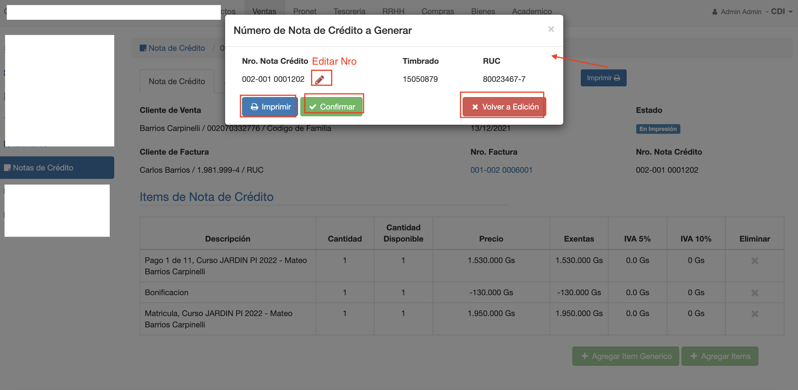
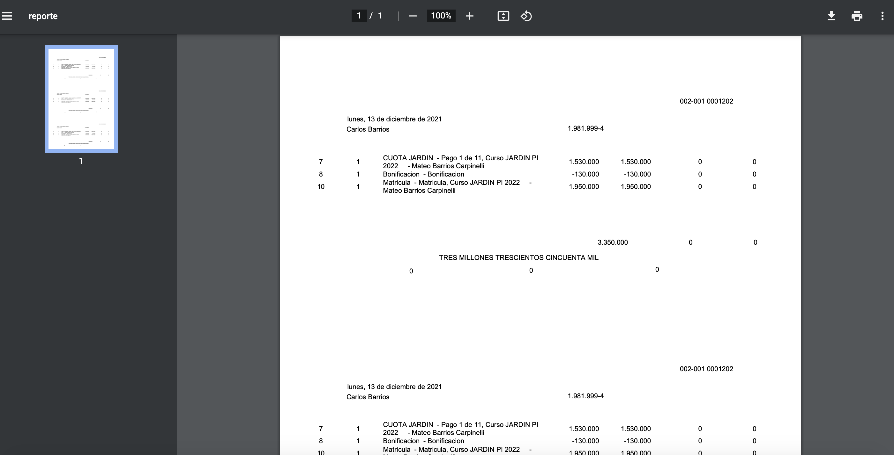
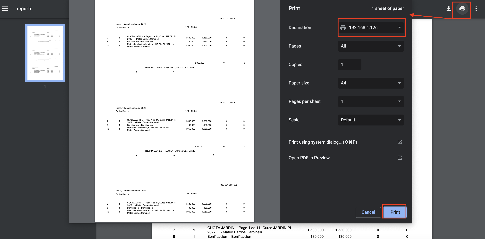

#Imprimir Nota de Crédito

Luego de registrar los items de la nota de crédito, se debe emitir la nota de crédito e imprimir.
La emisión de la nota de crédito:

- Cambia la NC al estado Emitido.
- Restablece los saldos de los items de la factura. Si corresponde.
- Asigna Nro de boleta del talonario a la nota de crédito.
- Genera el asiento contable de la nota de crédito.

##Imprimir
Al pulsar imprimir se despliega una interfaz donde se muestra el nro de boleta que
se va a asignar a la NC.

Esta interfaz ofrece las siguientes acciones:

- **Imprimir**: Si se acepta el nro asignado y se quiere imprimir directamente. Esta acción emite la
nota de crédito y luego exporta la nota de crédito a PDF, para imprimir. Luego pide confirmación para emitir la NC con el nro impreso.
- **Confirmar**: Emite la nota de crédito, sin imprimir. La nota de crédito pasa al estado Emitido.
- **Editar Nro**: Permite asignar otro nro a la nota de crédito. Luego de asignar se vuelve a mostrar la interface para
imprimir.
- **Volver a Edicion**: Permite cancelar la acción de Imprimir y volver al estado En Proceso. Por ejemplo, para realizar algún cambio.

###Cambio de Estado
Al pulsar *Imprimir*, la nota de crédito pasa al estado En Impresión.
Si se pulsa Confirmar o Imprimir y luego confirmar. La nota de crédito pasa al estado Emitido.
Si se pulsa Volver a Edición. La nota de crédito vuelve al estado En Proceso. Para continuar con la edición.

##Impresión en PDF
Al pulsar el botón Imprimir el sistema exporta la nota de crédito a un archivo en formato PDF. Este archivo PDF, puede abrirse
con el navegador.

Se puede notar que el .pdf sólo muestra los datos, ya que debe adecuarse al papel pre-impreso. Se puede imprimir de la
siguiente manera:

- Clic en el ícono de imprimir del PDF.
- Elegir la impresora destino.
- Pulsar Imprimir.

Obs. El papel debe estar configurado de acuerdo a la medida del papel pre-impreso. Por ej. Papel Oficio.

