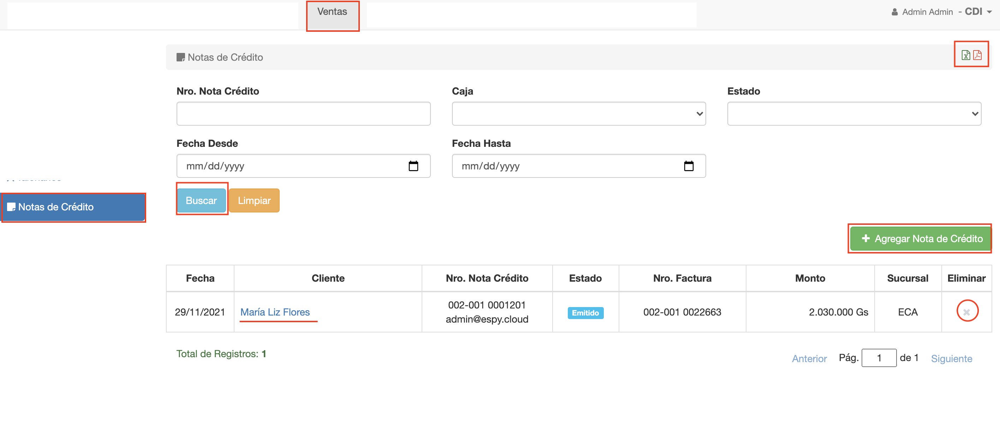

#Notas de Crédito

@@toc { depth=1 }
@@@ index
* [Crear Nota de Crédito](crear_nota_de_credito.md)
* [Editar Nota de Crédito](editar_nota_de_credito.md)
* [Imprimir Nota de Crédito](imprimir_nota_de_credito.md)
* [Asientos de Nota de Crédito](asientos.md)
* [Revision de Nota de Crédito](revision_de_nota_credito.md)
* [Finalizacion de Nota de Crédito](finalizacion_de_nota_credito.md)
* [Anular Nota de Crédito](anular_nota_de_credito.md)
@@@

En caso que una factura ya emitida no se pueda o quiera anular. Se puede revertir 
con una nota de crédito.
La reversión mediante nota de crédito puede ser parcial o total. Puede elegirse revertir
por items de factura.

Para acceder a la funcionalidad de Notas de Crédito de Venta, ingresar al módulo de *Ventas* y luego
ir a la opción de *Notas de Crédito*. Se despliega el listado de notas de crédito.

##Listado
El listado de notas de crédito ofrece:

- Una grilla con el listado de las notas de crédito registradas. Para cada nota de crédito, ofrece
un enlace para acceder/editar y un botón para eliminar la nota de crédito.
- Un buscador de notas de crédito, con varios filtros de búsqueda.
- Boton para exportar listado de las notas de crédito en formato pdf o excel.
- Un botón para agregar nota de crédito.

La grilla muestra los siguientes datos de cada nota de crédito:

- *Fecha*: La fecha de emisión de la nota de crédito.
- *Cliente*: El nombre de la razón social para la que se emitió la nota de crédito.
- *Nro. Nota Crédito*: El nro de boleta de talonario con que se emitió la nota de crédito. También en esta
columna se muestra el email del usuario que emitió.
- *Estado*: El estado de la nota de crédito que puede ser: En Proceso, Emitido, Anulado o En Revision.
- *Nro de Factura*: El nro de la factura de venta a la que se aplica la nota de crédito.
- *Monto*: El monto total de la nota de crédito.
- *Sucursal*: La sucursal de la caja, donde se emitió la nota de crédito.

##Busqueda

Para buscar notas de crédito, la interfaz ofrece los siguientes filtros:

-*Nro. Nota Crédito*: Para buscar por el nro, sin el prefijo. Es decir para la nota de crédito 002-001 000**1201**, el nro 
sin el prefijo sería: 1201.
-*Caja*: Para buscar notas de crédito emitidas en una caja elegida.
-*Estado*: Para buscar las notas de crédito por estado.
-*Fecha Desde*: Para buscar las notas de crédito que se emitieron desde la fecha desde.
-*Fecha Hasta*: Para buscar las notas de crédito que se emitieron hasta la fecha hasta.

Luego de completar los filtros clic en el botón buscar y se muestran los resultados encontrados en la grilla.
Si se quiere vaciar los filtros y restablecer la grilla, clic en Limpiar.

##Exportar notas de crédito

En la esquina superior derecha de la interfaz de listado, el sistema ofrece dos botones
para exportar las notas de crédito. Se puede exportar en:

-Formato Pdf
-Formato Excel

El listado exportado se realiza de acuerdo al filtrado actual aplicado. Es decir, si se realiza una busqueda y luego se exporta. Se exporta el listado
de notas de créditos que resultaron de la búsqueda.

