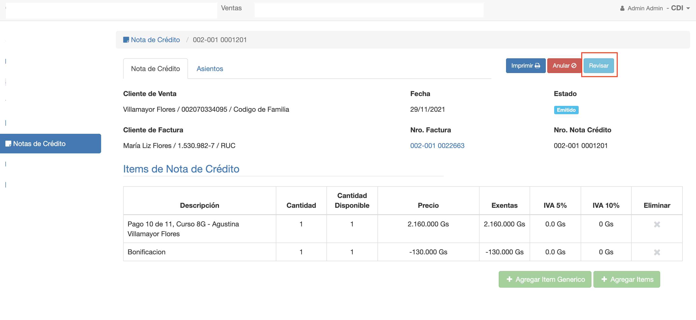

#Revision de Nota de Crédito

Si ya se emitió la nota de crédito, se habilita la opción de Revisar.
La revision pasa la nota de crédito al estado En Revision. En este estado:

 - Se pueden modificar los items de la nota de crédito.
 - Se puede modificar el nro de la nota de crédito.

Luego de realizar todos los cambios y confirmar o emitir la nota de crédito, ocurre lo siguiente:

- Se regenera el asiento contable. Por si hay algún cambio en montos o cuenta contable.
- Se pasa la NC al estado Emitido.

